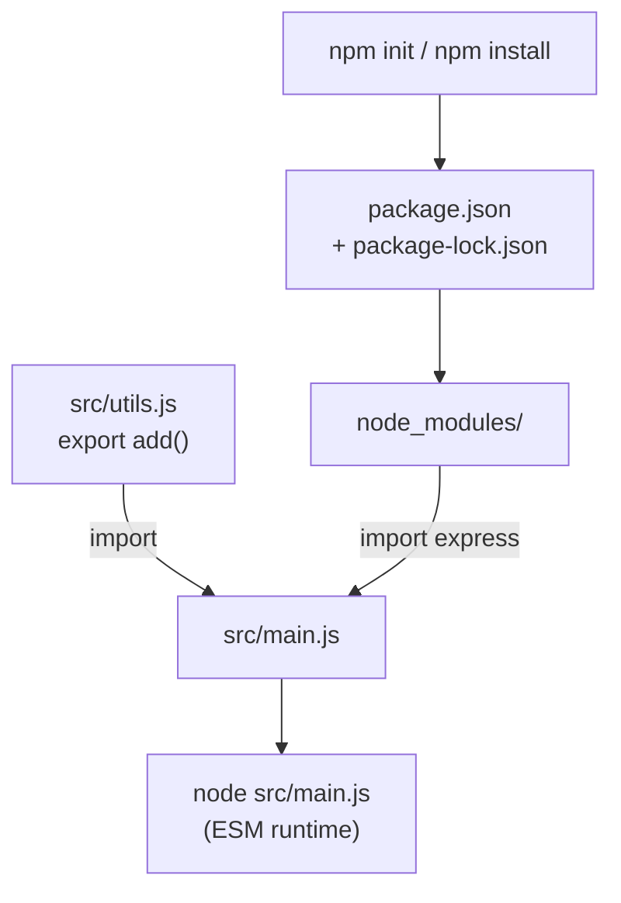

# Ngày 1 — Nền tảng JavaScript cho Node & Module System

## 🎯 Mục tiêu ngày

- Nắm vững các đặc tính JavaScript làm nền cho mọi đoạn code Node: **first-class functions**, **higher-order functions**, **closure**.
- Phân biệt hai hệ module: **CommonJS (CJS)** và **ES Modules (ESM)** — và vì sao roadmap này dùng **ESM-first**.
- Hiểu vai trò của **NPM**, `package.json`, **semver**, và scripts.
- **Project Tasks API**: khởi tạo repo, cấu hình ESM, tạo skeleton đầu tiên.

> Đây là ngày đặt nền. Bạn chưa viết server, nhưng mọi thứ về sau (event loop, async, Express) đều dựa trên các khái niệm hôm nay.

---

## ❓ Câu hỏi cần trả lời được

1. "First-class function" nghĩa là gì? Cho ví dụ một higher-order function.
2. `module.exports` / `require` khác `export` / `import` thế nào?
3. Vì sao Node hỗ trợ cả CJS lẫn ESM? Khi nào file được coi là ESM?
4. `dependencies` khác `devDependencies` ra sao? `^1.2.3` trong semver nghĩa là gì?
5. `package-lock.json` dùng để làm gì?

---

## 📚 Lý thuyết cốt lõi

### 1. First-class functions & Higher-order functions

Trong JavaScript, **hàm là giá trị hạng nhất (first-class)**: có thể gán vào biến, truyền làm tham số, hoặc trả về từ hàm khác.

```js
// Gán hàm vào biến
const greet = (name) => `Xin chào, ${name}`;

// Truyền hàm làm tham số → đây là Higher-Order Function (HOF)
const numbers = [1, 2, 3, 4];
const doubled = numbers.map((n) => n * 2); // [2, 4, 6, 8]
const even = numbers.filter((n) => n % 2 === 0); // [2, 4]

// Trả về một hàm (closure giữ lại biến `factor`)
function multiplier(factor) {
  return (n) => n * factor;
}
const triple = multiplier(3);
triple(5); // 15
```

**HOF** là hàm nhận hàm khác làm tham số hoặc trả về hàm. `map`, `filter`, `reduce`, và toàn bộ cơ chế **callback** trong Node đều dựa trên đặc tính này.

### 2. Module System: CJS vs ESM

Một file lớn khó bảo trì. Module cho phép tách code thành các file nhỏ, mỗi file có trách nhiệm riêng và chỉ phơi bày (export) những gì cần thiết.

**CommonJS (cũ, mặc định lịch sử của Node):**

```js
// utils.cjs
function add(a, b) {
  return a + b;
}
module.exports = { add };

// main.cjs
const { add } = require("./utils.cjs");
```

**ES Modules (chuẩn hiện đại — roadmap dùng cái này):**

```js
// utils.js
export function add(a, b) {
  return a + b;
}
export default function subtract(a, b) {
  return a - b;
}

// main.js
import subtract, { add } from "./utils.js";
```

**Khi nào Node coi file là ESM?**
- File có đuôi `.mjs`, **hoặc**
- `package.json` có `"type": "module"` (khi đó `.js` mặc định là ESM).

| Tiêu chí | CommonJS | ES Modules |
|---|---|---|
| Cú pháp export | `module.exports` | `export` / `export default` |
| Cú pháp import | `require()` | `import` |
| Thời điểm nạp | Đồng bộ, runtime | Tĩnh, phân tích trước |
| Top-level await | Không | Có |
| Chuẩn tương lai | Đang dần thay thế | ✅ |

### 3. NPM, package.json & semver

**NPM** là trình quản lý package đi kèm Node, kết nối kho package online khổng lồ.

```jsonc
{
  "name": "tasks-api",
  "version": "1.0.0",
  "type": "module",          // bật ESM cho mọi file .js
  "scripts": {
    "start": "node src/server.js",
    "dev": "node --watch src/server.js"
  },
  "dependencies": {           // cần khi chạy production
    "express": "^4.19.2"
  },
  "devDependencies": {        // chỉ cần khi phát triển/test
    "supertest": "^7.0.0"
  }
}
```

**Semver** (`MAJOR.MINOR.PATCH`, vd `4.19.2`):
- `MAJOR` — thay đổi phá vỡ tương thích.
- `MINOR` — thêm tính năng, vẫn tương thích.
- `PATCH` — sửa lỗi.
- `^4.19.2` — cho phép cập nhật MINOR/PATCH (`>=4.19.2 <5.0.0`).
- `~4.19.2` — chỉ cho phép PATCH (`>=4.19.2 <4.20.0`).

`package-lock.json` ghi lại **chính xác** version đã cài (cả dependency lồng nhau) để mọi máy cài giống hệt nhau → build tái lập được.

---

## 🗺️ Sơ đồ: Luồng module & quản lý package



---

## 🛠️ Project Tasks API — Hôm nay làm gì

Hôm nay ta **khởi tạo project** sẽ xây dần suốt 14 ngày.

```bash
mkdir tasks-api && cd tasks-api
npm init -y
```

Sửa `package.json` để bật ESM và thêm script:

```jsonc
{
  "name": "tasks-api",
  "version": "0.1.0",
  "type": "module",
  "scripts": {
    "start": "node src/index.js"
  }
}
```

Tạo `src/tasks.js` — "store" tạm trong bộ nhớ + vài HOF để luyện tập:

```js
// src/tasks.js
let tasks = [
  { id: 1, title: "Học event loop", done: false },
  { id: 2, title: "Viết REST API", done: false },
];

export const getAll = () => tasks;
export const getDone = () => tasks.filter((t) => t.done); // HOF: filter
export const titles = () => tasks.map((t) => t.title); // HOF: map

export function add(title) {
  const id = tasks.length ? Math.max(...tasks.map((t) => t.id)) + 1 : 1;
  const task = { id, title, done: false };
  tasks = [...tasks, task];
  return task;
}
```

Tạo `src/index.js` để thử:

```js
// src/index.js
import { getAll, add, titles } from "./tasks.js";

add("Đọc về ESM");
console.log("Tất cả:", getAll());
console.log("Tiêu đề:", titles());
```

Chạy:

```bash
npm start
```

---

## ✏️ Bài tập

1. Viết một HOF `applyToAll(arr, fn)` tự cài đặt lại logic giống `map` (không dùng `Array.prototype.map`).
2. Thêm hàm `remove(id)` vào `src/tasks.js` dùng `filter` để xoá task theo `id`, trả về task đã xoá (hoặc `null`).
3. Chuyển `src/tasks.js` sang viết bằng CommonJS trong một file `tasks.cjs` riêng, rồi `require` nó từ một file `.cjs`. Quan sát điểm khác biệt.
4. Trong `package.json`, đổi `^` thành `~` cho một dependency và giải thích phạm vi version thay đổi thế nào.

---

## ✅ Self-check (đáp án ngắn)

1. **First-class function**: hàm được đối xử như giá trị (gán biến, truyền, trả về). Ví dụ HOF: `arr.map(fn)` nhận `fn` làm tham số.
2. `module.exports`/`require` là CommonJS (đồng bộ, runtime); `export`/`import` là ESM (tĩnh, hỗ trợ top-level await, là chuẩn hiện đại).
3. Node giữ CJS để tương thích ngược; coi file là ESM khi đuôi `.mjs` hoặc `package.json` có `"type": "module"`.
4. `dependencies` cần khi chạy thật; `devDependencies` chỉ khi phát triển/test. `^1.2.3` cho phép cập nhật MINOR+PATCH nhưng không lên MAJOR (`<2.0.0`).
5. `package-lock.json` khoá chính xác version mọi package (kể cả lồng nhau) để cài đặt tái lập được trên mọi máy.
