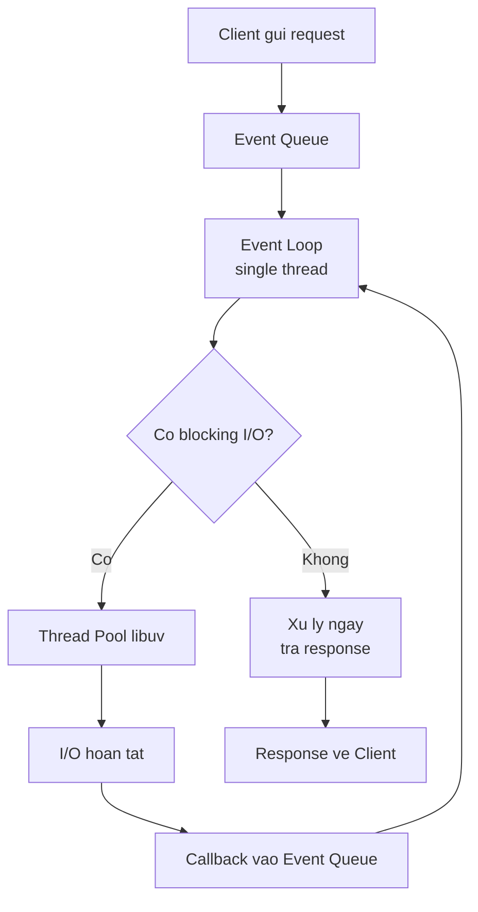

# Ngày 2 — Node Runtime, V8 & HTTP Server đầu tiên

## 🎯 Mục tiêu ngày

- Hiểu mô hình **single-thread, event-driven** của Node và vì sao nó scale tốt.
- Nắm vai trò của engine **V8** trong việc chạy JavaScript.
- Biết các ưu điểm cốt lõi khiến Node phù hợp cho I/O-heavy app.
- **Project Tasks API**: dựng raw HTTP server bằng module `http`, trả danh sách tasks dạng JSON.

> Hôm nay bạn viết server thật đầu tiên. Đừng vội dùng Express — hiểu `http` thuần giúp bạn nắm điều framework che giấu.

---

## ❓ Câu hỏi cần trả lời được

1. Node xử lý một request như thế nào khi gặp blocking I/O?
2. Vì sao Node chọn mô hình single-thread thay vì multithreading truyền thống?
3. V8 là gì và vì sao Node dùng nó?
4. Kể 3 ưu điểm chính của Node so với server truyền thống.
5. `res.writeHead` và `res.end` làm gì trong một HTTP response?

---

## 📚 Lý thuyết cốt lõi

### 1. Node hoạt động thế nào?

Node **event-driven** và **single-threaded**. Mỗi request đến được coi là một *event*. Khi gặp tác vụ blocking I/O (đọc file, gọi DB), Node **không đứng chờ** — nó đăng ký một callback rồi tiếp tục xử lý event kế tiếp. Khi I/O xong, callback được đưa vào hàng đợi để chạy.

Luồng tổng quát:

```
Client → Event Queue → Event Loop (1 thread, "trái tim" của Node)
                              │
                   nếu blocking I/O → Thread Pool (libuv) xử lý
                              │
                       I/O xong → callback → Response
```

Nhờ vậy một thread duy nhất phục vụ được hàng nghìn kết nối đồng thời, miễn là tác vụ không nặng CPU.

### 2. Vì sao single-thread?

Đây là một lựa chọn thiết kế có chủ đích. Với app **không nặng CPU** (chủ yếu I/O: web server, API), xử lý bất đồng bộ trên một thread cho **scalability** tốt hơn mô hình "mỗi request một thread" kiểu Apache/IIS — vốn tốn bộ nhớ và chi phí chuyển ngữ cảnh (context switching) khi có nhiều kết nối.

> Lưu ý: "single-thread" chỉ đúng với phần JavaScript của bạn. Bên dưới, libuv vẫn dùng một **thread pool** cho một số tác vụ (xem Ngày 3).

### 3. V8 engine

**V8** là engine JavaScript của Google, viết bằng C++, biên dịch JS sang mã máy nên rất nhanh. Có các engine khác (SpiderMonkey của Firefox, Chakra của Edge cũ), nhưng V8 được chọn vì nhanh nhất, mã nguồn mở và cộng đồng lớn. Nó chạy cả JavaScript lẫn WebAssembly.

### 4. Ưu điểm của Node

| Ưu điểm | Ý nghĩa |
|---|---|
| Asynchronous | API non-blocking, không chặn thread chính |
| Nhanh | V8 + lõi C++ |
| Đơn giản, hiệu quả | Single-thread + event loop phục vụ nhiều request hơn |
| Hệ sinh thái lớn | NPM với hàng trăm nghìn package |

---

## 🗺️ Sơ đồ: Luồng xử lý request của Node



---

## 🛠️ Project Tasks API — Hôm nay làm gì

Hôm nay ta dựng HTTP server đầu tiên cho Tasks API bằng module `http` có sẵn (không cần cài gì).

Tạo `src/server.js`:

```js
// src/server.js
import http from "node:http";
import { getAll, add } from "./tasks.js";

const PORT = 3000;

const server = http.createServer((req, res) => {
  // Route đơn giản dựa trên method + url
  if (req.method === "GET" && req.url === "/tasks") {
    res.writeHead(200, { "Content-Type": "application/json" });
    res.end(JSON.stringify(getAll()));
    return;
  }

  // Không khớp route nào
  res.writeHead(404, { "Content-Type": "application/json" });
  res.end(JSON.stringify({ error: "Not Found" }));
});

server.listen(PORT, () => {
  console.log(`Tasks API chạy tại http://localhost:${PORT}`);
});
```

Cập nhật script `start` trong `package.json` trỏ tới file này, rồi chạy:

```bash
node src/server.js
# Mở trình duyệt hoặc:
curl http://localhost:3000/tasks
```

Bạn sẽ nhận về JSON danh sách tasks từ store in-memory tạo ở Ngày 1.

---

## ✏️ Bài tập

1. Thêm route `GET /` trả về một thông điệp chào mừng dạng JSON `{ message: "Tasks API" }`.
2. Thêm route `GET /tasks/done` trả về chỉ các task đã hoàn thành (dùng hàm `getDone` từ Ngày 1).
3. In ra console `method` và `url` của mỗi request đến (một dạng logging thủ công).
4. Thử mở 2 request "chậm" cùng lúc (dùng `setTimeout` giả lập) và quan sát server vẫn nhận request mới — minh hoạ non-blocking.

---

## ✅ Self-check (đáp án ngắn)

1. Khi gặp blocking I/O, Node đăng ký callback và chuyển sang xử lý event kế; tác vụ I/O được thread pool xử lý, xong thì callback vào hàng đợi để chạy.
2. Single-thread + async cho scalability tốt hơn với app I/O-heavy: ít tốn bộ nhớ và context switching hơn mô hình mỗi-request-một-thread.
3. V8 là engine JS của Google (C++), biên dịch JS sang mã máy nên nhanh; được chọn vì nhanh nhất, mã nguồn mở, cộng đồng lớn.
4. Asynchronous (non-blocking), nhanh (V8 + C++), đơn giản/hiệu quả (single-thread + event loop), hệ sinh thái NPM lớn.
5. `res.writeHead` đặt status code + header; `res.end` gửi body và kết thúc response.
