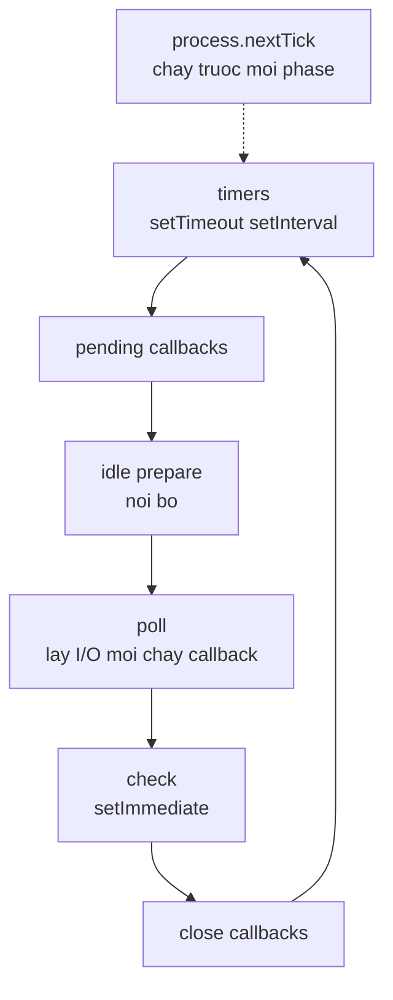

# Ngày 3 — Event Loop & Non-blocking I/O

## 🎯 Mục tiêu ngày

- Hiểu **event loop** cho phép non-blocking I/O dù JavaScript chạy single-thread.
- Nắm **6 phase** của event loop và thứ tự chạy của `process.nextTick()` vs `setImmediate()`.
- Hiểu vai trò của **libuv** và **thread pool**.
- Phân biệt **blocking** vs **non-blocking** qua thực nghiệm.
- **Project Tasks API**: đọc/ghi tasks ra file, quan sát thứ tự log chứng minh non-blocking.

> Đây là khái niệm quan trọng nhất của Node. Nắm chắc hôm nay thì mọi thứ async về sau đều sáng tỏ.

---

## ❓ Câu hỏi cần trả lời được

1. Event loop là gì và nó giúp Node non-blocking bằng cách nào?
2. Kể tên 6 phase của event loop theo đúng thứ tự.
3. `process.nextTick()` khác `setImmediate()` ở điểm nào?
4. libuv là gì? Thread pool mặc định có mấy thread?
5. `fs.readFileSync` và `fs.readFile` khác nhau ra sao về hành vi chặn?

---

## 📚 Lý thuyết cốt lõi

### 1. Event Loop là gì?

Event loop là cơ chế cho phép Node thực hiện **non-blocking I/O** dù JavaScript chỉ chạy trên một thread. Ý tưởng: khi có thể, Node offload tác vụ xuống kernel hệ điều hành hoặc thread pool, rồi tiếp tục chạy; khi tác vụ xong, callback được đưa trở lại để thực thi.

Nó hoạt động theo **observer pattern**: một tác vụ phát ra event, event kích hoạt callback (listener) đã đăng ký.

### 2. Sáu phase của Event Loop

Mỗi vòng lặp đi qua các phase theo thứ tự:

```
   ┌───────────────────────────┐
┌─>│           timers          │  setTimeout / setInterval
│  ├───────────────────────────┤
│  │     pending callbacks     │  callback I/O bị hoãn
│  ├───────────────────────────┤
│  │       idle, prepare       │  nội bộ
│  ├───────────────────────────┤
│  │           poll            │  lấy event I/O mới, chạy callback
│  ├───────────────────────────┤
│  │           check           │  setImmediate
│  ├───────────────────────────┤
└──┤      close callbacks      │  vd socket.on('close')
   └───────────────────────────┘
```

### 3. `process.nextTick()` vs `setImmediate()`

- `process.nextTick(cb)` — chạy **ngay đầu vòng lặp kế tiếp**, trước cả các phase I/O. Ưu tiên cao nhất.
- `setImmediate(cb)` — chạy ở phase **check**, sau phase poll.

```js
console.log("bắt đầu");
setImmediate(() => console.log("setImmediate"));
process.nextTick(() => console.log("nextTick"));
console.log("kết thúc");

// Output:
// bắt đầu
// kết thúc
// nextTick      ← chạy trước
// setImmediate
```

### 4. libuv & Thread Pool

**libuv** là thư viện C đa nền tảng cung cấp khả năng async I/O cho Node: filesystem, networking, DNS, và một số tác vụ CPU (crypto, zlib). Nó duy trì một **thread pool** (mặc định **4 thread**) để xử lý các tác vụ không thể async ở mức kernel.

> Điều chỉnh số thread bằng biến môi trường `UV_THREADPOOL_SIZE`.

### 5. Blocking vs Non-blocking

| | `fs.readFileSync` | `fs.readFile` |
|---|---|---|
| Hành vi | **Chặn** tới khi đọc xong | Đăng ký callback, **không chặn** |
| Code sau nó | Chờ | Chạy ngay |
| Dùng khi | Script khởi động đơn giản | Server xử lý nhiều request |

```js
import fs from "node:fs";

// Blocking — dòng dưới phải chờ
const data = fs.readFileSync("file.txt", "utf8");
console.log(data);

// Non-blocking — moreWork() chạy TRƯỚC khi đọc xong
fs.readFile("file.txt", "utf8", (err, data) => {
  if (err) throw err;
  console.log(data);
});
moreWork(); // chạy trước callback trên
```

### 6. (Nâng cao / optional) Streams & Buffers

Khi xử lý dữ liệu **lớn** (video, file lớn) ta không nên nạp hết vào bộ nhớ. **Streams** cho phép xử lý dữ liệu theo từng phần. Có 4 loại: **Readable**, **Writable**, **Duplex** (cả hai), **Transform** (biến đổi dữ liệu khi truyền). Stream là instance của `EventEmitter`. **Buffer** là vùng nhớ cố định chứa **binary data** trong lúc truyền.

> Phần này chỉ giới thiệu để biết. Bạn chưa cần dùng ngay cho Tasks API.

---

## 🗺️ Sơ đồ: Sáu phase của Event Loop



---

## 🛠️ Project Tasks API — Hôm nay làm gì

Hôm nay ta lưu tasks ra file JSON và quan sát non-blocking.

Tạo `src/store.js` — đọc/ghi file bằng cả 2 cách để so sánh:

```js
// src/store.js
import fs from "node:fs";

const FILE = "tasks.json";

// Cách non-blocking (callback)
export function loadTasks(cb) {
  fs.readFile(FILE, "utf8", (err, data) => {
    if (err) return cb(err);
    cb(null, JSON.parse(data));
  });
}

export function saveTasks(tasks, cb) {
  fs.writeFile(FILE, JSON.stringify(tasks, null, 2), cb);
}
```

Thử nghiệm chứng minh non-blocking trong `src/demo.js`:

```js
// src/demo.js
import { loadTasks } from "./store.js";

console.log("1 — trước khi đọc file");
loadTasks((err, tasks) => {
  if (err) return console.error("Lỗi đọc:", err.message);
  console.log("3 — đọc xong:", tasks.length, "tasks");
});
console.log("2 — sau khi gọi loadTasks (chạy TRƯỚC callback)");

// Thứ tự log: 1 → 2 → 3  (chứng minh non-blocking)
```

Trước tiên tạo `tasks.json` với nội dung `[]` rồi chạy:

```bash
echo "[]" > tasks.json
node src/demo.js
```

---

## ✏️ Bài tập

1. Viết phiên bản `loadTasksSync()` dùng `fs.readFileSync` và quan sát thứ tự log thay đổi thế nào.
2. Dự đoán output của đoạn code có `setTimeout(fn, 0)`, `setImmediate(fn)`, `process.nextTick(fn)` cùng lúc, rồi chạy để kiểm chứng.
3. Đặt `UV_THREADPOOL_SIZE=2` rồi chạy 4 thao tác `crypto.pbkdf2` đo thời gian; so với mặc định.
4. Giải thích bằng lời vì sao dùng `readFileSync` trong một HTTP server xử lý nhiều request là ý tưởng tồi.

---

## ✅ Self-check (đáp án ngắn)

1. Event loop cho phép non-blocking I/O bằng cách offload tác vụ xuống kernel/thread pool rồi chạy callback khi xong, thay vì chặn thread chính.
2. timers → pending callbacks → idle,prepare → poll → check → close callbacks.
3. `process.nextTick` chạy ngay đầu vòng kế (trước mọi phase I/O); `setImmediate` chạy ở phase check (sau poll).
4. libuv là thư viện C cung cấp async I/O + thread pool cho Node; thread pool mặc định 4 thread.
5. `fs.readFileSync` chặn tới khi đọc xong; `fs.readFile` đăng ký callback và không chặn, code sau nó chạy trước.
