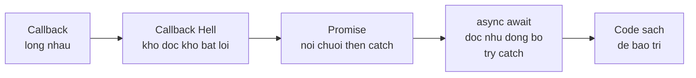

# Ngày 4 — Async Patterns: Callback → Promise → async/await

## 🎯 Mục tiêu ngày

- Hiểu **callback hell** và vì sao cần thoát khỏi nó.
- Nắm **Promise** và cách nó làm code async dễ quản lý hơn.
- Thành thạo **async/await** — cú pháp async hiện đại.
- Cài đặt **exponential backoff retry** — một pattern thực chiến.
- **Project Tasks API**: refactor phần đọc/ghi file sang `fs/promises` + async/await, thêm retry.

> Hôm qua bạn dùng callback. Hôm nay bạn nâng cấp lên async/await — cách viết async mà mọi codebase Node hiện đại đều dùng.

---

## ❓ Câu hỏi cần trả lời được

1. Callback hell là gì và gây hại thế nào?
2. Promise giải quyết vấn đề gì so với callback?
3. `async/await` liên quan đến Promise ra sao?
4. Phân biệt "asynchronous" và "non-blocking".
5. Exponential backoff là gì và dùng khi nào?

---

## 📚 Lý thuyết cốt lõi

### 1. Callback Hell

Khi chuỗi nhiều tác vụ async tuần tự, callback lồng vào nhau tạo "kim tự tháp của sự diệt vong" (pyramid of doom) — khó đọc, khó xử lý lỗi:

```js
loadTasks((err, tasks) => {
  if (err) return handle(err);
  addTask(tasks, "mới", (err, updated) => {
    if (err) return handle(err);
    saveTasks(updated, (err) => {
      if (err) return handle(err);
      console.log("xong"); // lồng 3 tầng
    });
  });
});
```

Cách thoát: dùng **Promise**, **async/await**, hoặc thư viện `async`.

### 2. Promise

Một **Promise** là object đại diện cho kết quả tương lai của một tác vụ async, có 3 trạng thái: *pending* → *fulfilled* hoặc *rejected*. Nó cho phép nối chuỗi `.then()` thay vì lồng callback:

```js
loadTasksP()
  .then((tasks) => addTaskP(tasks, "mới"))
  .then((updated) => saveTasksP(updated))
  .then(() => console.log("xong"))
  .catch(handle); // bắt lỗi tập trung
```

### 3. async/await

`async/await` là "đường cú pháp" (syntactic sugar) trên Promise: viết code async trông như đồng bộ, dễ đọc, dùng `try/catch` để bắt lỗi.

```js
async function run() {
  try {
    const tasks = await loadTasksP();
    const updated = await addTaskP(tasks, "mới");
    await saveTasksP(updated);
    console.log("xong");
  } catch (err) {
    handle(err);
  }
}
```

`await` chỉ dùng được trong hàm `async` (hoặc top-level trong ESM module).

### 4. Asynchronous vs Non-blocking

| | Asynchronous | Non-blocking |
|---|---|---|
| Phản hồi | Không trả ngay, kết quả đến sau | Trả **ngay** data có sẵn hoặc lỗi |
| Ví von | Gửi email, trả lời sau | Hỏi nhanh, nhận đáp ngay |
| Điểm chung | Không làm dừng tiến trình chính | Không halt execution |

### 5. Exponential Backoff Retry

Khi một thao tác (gọi mạng, query) có thể fail tạm thời, ta thử lại nhiều lần với **thời gian chờ tăng theo cấp số nhân** (`2^i`) để tránh dồn tải:

```js
function wait(ms) {
  return new Promise((resolve) => setTimeout(resolve, ms));
}

async function withRetry(fn, maxRetries = 5) {
  for (let i = 0; i < maxRetries; i++) {
    try {
      return await fn();
    } catch (err) {
      if (i === maxRetries - 1) throw err; // hết lượt
      const delay = Math.pow(2, i) * 100; // 100, 200, 400, 800...
      console.log(`Thử lại sau ${delay}ms`);
      await wait(delay);
    }
  }
}
```

### 6. Promisify callback API

Nhiều API cũ dùng callback. Chuyển sang Promise bằng `util.promisify` hoặc dùng sẵn `fs/promises`:

```js
import { promisify } from "node:util";
import fs from "node:fs";

const readFileP = promisify(fs.readFile);
// hoặc đơn giản:
import { readFile } from "node:fs/promises";
```

---

## 🗺️ Sơ đồ: Tiến hoá của async pattern



---

## 🛠️ Project Tasks API — Hôm nay làm gì

Refactor `src/store.js` từ callback sang `fs/promises` + async/await, và thêm retry.

```js
// src/store.js
import { readFile, writeFile } from "node:fs/promises";

const FILE = "tasks.json";

export async function loadTasks() {
  const data = await readFile(FILE, "utf8");
  return JSON.parse(data);
}

export async function saveTasks(tasks) {
  await writeFile(FILE, JSON.stringify(tasks, null, 2));
}
```

Thêm `src/retry.js` với exponential backoff:

```js
// src/retry.js
const wait = (ms) => new Promise((r) => setTimeout(r, ms));

export async function withRetry(fn, maxRetries = 5) {
  for (let i = 0; i < maxRetries; i++) {
    try {
      return await fn();
    } catch (err) {
      if (i === maxRetries - 1) throw err;
      await wait(Math.pow(2, i) * 100);
    }
  }
}
```

Dùng thử trong `src/demo.js`:

```js
// src/demo.js
import { loadTasks, saveTasks } from "./store.js";
import { withRetry } from "./retry.js";

async function main() {
  const tasks = await loadTasks();
  tasks.push({ id: Date.now(), title: "Học async/await", done: false });
  await withRetry(() => saveTasks(tasks));
  console.log("Đã lưu", tasks.length, "tasks");
}

main().catch((err) => console.error("Thất bại:", err.message));
```

```bash
node src/demo.js
```

---

## ✏️ Bài tập

1. Chuyển đoạn callback hell ở mục 1 thành phiên bản async/await tương đương.
2. Viết một hàm `flaky()` ngẫu nhiên throw ~50% số lần, rồi bọc nó bằng `withRetry` và quan sát log thử lại.
3. So sánh `Promise.all([...])` (chạy song song) với `await` tuần tự về thời gian khi load 3 file.
4. Giải thích vì sao `await` trong vòng `for` tuần tự khác với gom các Promise rồi `Promise.all`.

---

## ✅ Self-check (đáp án ngắn)

1. Callback hell là các callback lồng nhau sâu khi chuỗi async tuần tự, gây khó đọc và khó xử lý lỗi.
2. Promise trả về một object kết quả tương lai, cho phép nối chuỗi `.then()`/`.catch()` thay vì lồng callback và bắt lỗi tập trung.
3. `async/await` là syntactic sugar trên Promise: `await` chờ một Promise resolve, viết async trông như đồng bộ, dùng `try/catch` bắt lỗi.
4. Asynchronous = kết quả đến sau, không phụ thuộc thứ tự; non-blocking = trả lời ngay (data hoặc lỗi), không làm dừng tiến trình.
5. Exponential backoff là thử lại với thời gian chờ tăng theo `2^i`; dùng khi thao tác có thể fail tạm thời (gọi mạng, query) để tránh dồn tải.
