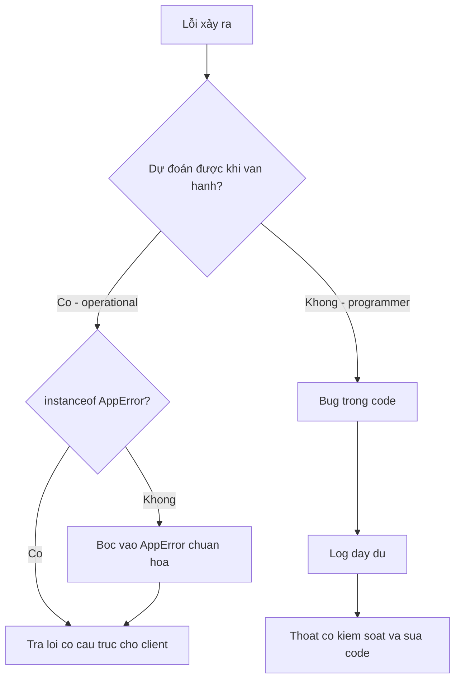

# Ngày 5 — Error Handling đúng cách

## 🎯 Mục tiêu ngày

- Xử lý lỗi gọn gàng với **try/catch** + **async/await**, và hiểu mẫu **error-first callback** `(err, data) => {}`.
- Phân biệt **operational error** (lỗi dự đoán được) vs **programmer error** (bug) — và cách hành xử khác nhau với mỗi loại.
- Bắt lỗi cấp process: **unhandledRejection** và **uncaughtException** — biết best practice khi gặp chúng.
- Tự tạo **custom Error class** (vd `AppError` có `statusCode`) để chuẩn hoá lỗi cho API.
- **Project Tasks API**: thêm `src/errors.js`, bọc thao tác đọc/ghi file trong try/catch trả lỗi có cấu trúc, và gắn handler `unhandledRejection`.

> Lỗi là chuyện bình thường, không phải ngoại lệ hiếm gặp. Một service tốt không phải là service không bao giờ lỗi, mà là service biết phân loại lỗi và phản ứng đúng với từng loại.

---

## ❓ Câu hỏi cần trả lời được

1. try/catch có bắt được lỗi trong callback async không? Vì sao async/await lại bắt được?
2. Error-first callback là gì? Tại sao tham số `err` luôn đứng đầu tiên?
3. Operational error và programmer error khác nhau ra sao? Nên xử lý mỗi loại thế nào?
4. `unhandledRejection` và `uncaughtException` được phát ra khi nào? Best practice với `uncaughtException` là gì?
5. Vì sao nên tạo custom Error class thay vì ném chuỗi (string) hay object thường?
6. Lỗi lan truyền qua một Promise chain / async function như thế nào?

---

## 📚 Lý thuyết cốt lõi

### 1. try/catch với async/await & error-first callback

Trong Node có hai phong cách bắt lỗi async. Phong cách **callback** cũ dùng quy ước **error-first**: tham số đầu tiên luôn là `err`, nếu `err` là `null` nghĩa là thành công.

```js
import { readFile } from "node:fs";

// error-first callback: (err, data) => {}
readFile("data.json", "utf8", (err, data) => {
  if (err) {
    console.error("Đọc file thất bại:", err.message);
    return; // dừng sớm khi có lỗi
  }
  console.log("Nội dung:", data);
});
```

Phong cách hiện đại dùng **Promise + async/await**, cho phép viết lỗi async gần như lỗi đồng bộ với `try/catch`:

```js
import { readFile } from "node:fs/promises";

async function load() {
  try {
    const data = await readFile("data.json", "utf8");
    return JSON.parse(data);
  } catch (err) {
    console.error("Lỗi khi load:", err.message);
    throw err; // lan truyền tiếp cho người gọi
  }
}
```

> Lưu ý: `try/catch` **không** bắt được lỗi ném ra trong callback async kiểu cũ (vd bên trong `setTimeout`), vì callback chạy ở tick sau, ngoài ngữ cảnh `try`. Chỉ `await` mới "kéo" lỗi của Promise về đúng khối `try/catch`.

### 2. Operational error vs Programmer error

Đây là phân loại quan trọng nhất của ngày hôm nay.

| | Operational error | Programmer error |
|---|---|---|
| Bản chất | Tình huống dự đoán được khi vận hành | Bug trong code |
| Ví dụ | File không tồn tại, network fail, input sai | Gọi `undefined.foo`, sai kiểu tham số |
| Cách xử lý | **Bắt và xử lý** (retry, trả lỗi cho client) | **Để lộ ra / sửa code**, không nên "nuốt" |
| Mục tiêu | Phục hồi êm | Crash sớm để phát hiện và fix |

- **Operational error** là chuyện ta *biết trước có thể xảy ra*: ổ đĩa đầy, DNS hỏng, user gửi JSON sai. Ta xử lý đàng hoàng (trả `404`, retry, fallback).
- **Programmer error** là *bug*: gọi hàm không tồn tại, truyền sai tham số. Cố "cứu" nó thường che giấu vấn đề. Triết lý phổ biến: để nó crash, log đầy đủ, rồi sửa.

### 3. unhandledRejection & uncaughtException

Hai sự kiện cấp `process` là lưới an toàn cuối cùng.

```js
// Promise bị reject mà không có .catch() nào
process.on("unhandledRejection", (reason) => {
  console.error("Unhandled Rejection:", reason);
  // Log lại; cân nhắc thoát có kiểm soát ở môi trường nghiêm ngặt
});

// Exception đồng bộ không ai bắt → process đang ở trạng thái không chắc chắn
process.on("uncaughtException", (err) => {
  console.error("Uncaught Exception:", err);
  process.exit(1); // best practice: log rồi thoát có kiểm soát
});
```

- `unhandledRejection`: một Promise bị reject mà không có handler `.catch`/`try-catch`.
- `uncaughtException`: một lỗi đồng bộ "lọt lưới" tới tận top. Khi tới đây, **process đang ở trạng thái không tin cậy** — best practice là **log rồi thoát có kiểm soát** (process manager như PM2/systemd sẽ khởi động lại), thay vì cố tiếp tục chạy.

**Exit codes** đáng nhớ (đề cập ngắn): `1` — uncaught fatal exception; `5` — fatal error trong V8. `process.exit(0)` nghĩa là thoát bình thường.

### 4. Lan truyền lỗi (error propagation)

Trong Promise chain và async/await, lỗi tự "trôi" xuống tới handler gần nhất.

```js
async function step1() {
  throw new Error("step1 hỏng");
}
async function step2() {
  await step1(); // không bắt → lỗi nổi tiếp lên trên
}

step2().catch((err) => console.error("Bắt ở ngoài cùng:", err.message));
```

Một `throw` (hoặc Promise reject) bên trong sẽ bỏ qua các lệnh còn lại và nhảy ra ngoài cho tới khi gặp `catch`. Nhờ đó ta có thể **để lỗi đi lên** một tầng tập trung xử lý, thay vì rải `try/catch` khắp nơi.

### 5. Custom Error class

Ném chuỗi mất hết stack trace và metadata. Hãy mở rộng `Error` để gắn thêm thông tin chuẩn hoá cho API:

```js
// src/errors.js
export class AppError extends Error {
  constructor(message, { statusCode = 500, code = "INTERNAL" } = {}) {
    super(message);
    this.name = "AppError";
    this.statusCode = statusCode; // map sang HTTP status
    this.code = code; // mã lỗi nội bộ để client phân nhánh
  }
}

export class NotFoundError extends AppError {
  constructor(message = "Không tìm thấy") {
    super(message, { statusCode: 404, code: "NOT_FOUND" });
    this.name = "NotFoundError";
  }
}
```

Nhờ vậy tầng trên chỉ cần kiểm tra `err instanceof AppError` để biết đây là **operational error** đã chuẩn hoá (có `statusCode`, `code`) hay là một bug lạ cần để crash.

---

## 🗺️ Sơ đồ: Phân loại và xử lý lỗi



---

## 🛠️ Project Tasks API — Hôm nay làm gì

Tới Ngày 4, Tasks API đã có store + đọc/ghi file async + retry. Hôm nay ta **chuẩn hoá error handling** cho các thao tác đó.

Tạo `src/errors.js`:

```js
// src/errors.js
export class AppError extends Error {
  constructor(message, { statusCode = 500, code = "INTERNAL" } = {}) {
    super(message);
    this.name = "AppError";
    this.statusCode = statusCode;
    this.code = code;
  }
}

export class NotFoundError extends AppError {
  constructor(message = "Không tìm thấy task") {
    super(message, { statusCode: 404, code: "TASK_NOT_FOUND" });
    this.name = "NotFoundError";
  }
}

export class StorageError extends AppError {
  constructor(message = "Lỗi truy cập storage") {
    super(message, { statusCode: 500, code: "STORAGE_ERROR" });
    this.name = "StorageError";
  }
}
```

Bọc thao tác đọc/ghi file, trả về lỗi có cấu trúc thay vì để lỗi thô lộ ra:

```js
// src/store.js (trích — nối tiếp Ngày 4)
import { readFile, writeFile } from "node:fs/promises";
import { StorageError } from "./errors.js";

const FILE = "tasks.json";

export async function readTasks() {
  try {
    const raw = await readFile(FILE, "utf8");
    return JSON.parse(raw);
  } catch (err) {
    if (err.code === "ENOENT") return []; // file chưa có → coi như rỗng (operational)
    throw new StorageError(`Đọc ${FILE} thất bại: ${err.message}`);
  }
}

export async function writeTasks(tasks) {
  try {
    await writeFile(FILE, JSON.stringify(tasks, null, 2), "utf8");
  } catch (err) {
    throw new StorageError(`Ghi ${FILE} thất bại: ${err.message}`);
  }
}
```

Một helper trả kết quả theo cấu trúc `{ error, code }` để tầng gọi dễ phân nhánh:

```js
// src/tasks.js (trích)
import { readTasks, writeTasks } from "./store.js";
import { NotFoundError, AppError } from "./errors.js";

export async function completeTask(id) {
  try {
    const tasks = await readTasks();
    const task = tasks.find((t) => t.id === id);
    if (!task) throw new NotFoundError(`Không có task id=${id}`);
    task.done = true;
    await writeTasks(tasks);
    return { data: task };
  } catch (err) {
    if (err instanceof AppError) {
      return { error: err.message, code: err.code }; // operational, có cấu trúc
    }
    throw err; // programmer error → để lan lên trên
  }
}
```

Gắn lưới an toàn cấp process ở entry point:

```js
// src/index.js (trích)
process.on("unhandledRejection", (reason) => {
  console.error("[unhandledRejection]", reason);
});

process.on("uncaughtException", (err) => {
  console.error("[uncaughtException]", err);
  process.exit(1);
});
```

Chạy thử:

```bash
npm start
```

---

## ✏️ Bài tập

1. Thêm class `ValidationError` (kế thừa `AppError`, `statusCode: 400`, `code: "VALIDATION"`). Khi `add(title)` nhận `title` rỗng hoặc không phải chuỗi, ném `ValidationError`.
2. Viết hàm `safeRun(fn)` nhận một async function, chạy nó trong `try/catch`, trả `{ data }` khi thành công và `{ error, code }` khi gặp `AppError` — gom logic lặp lại ở `tasks.js` về một chỗ.
3. Cố tình tạo một **programmer error** (vd gọi `tasks.fnKhongTonTai()`) và một **operational error** (xoá quyền ghi `tasks.json`). Quan sát: loại nào bị handler `uncaughtException`/`unhandledRejection` bắt, loại nào trả `{ error, code }`.
4. Giải thích bằng lời: vì sao **không** nên dùng `process.on("uncaughtException")` để "tiếp tục chạy như chưa có gì"? (gợi ý: trạng thái process không còn tin cậy).

---

## ✅ Self-check (đáp án ngắn)

1. `try/catch` thường **không** bắt được lỗi trong callback async kiểu cũ (chạy ở tick sau). `async/await` bắt được vì `await` kéo lỗi của Promise về đúng khối `try/catch`.
2. Error-first callback có tham số đầu là `err` (null nếu thành công). Đặt `err` đầu tiên là quy ước thống nhất của Node để người gọi luôn kiểm tra lỗi trước khi dùng dữ liệu.
3. Operational error là lỗi dự đoán được khi vận hành (file mất, network fail) → bắt và xử lý/retry. Programmer error là bug (gọi undefined) → để lộ ra, log, sửa code; không nên "nuốt".
4. `unhandledRejection` phát khi một Promise reject mà không có handler; `uncaughtException` phát khi lỗi đồng bộ lọt tới top. Best practice với `uncaughtException`: log đầy đủ rồi thoát có kiểm soát (`process.exit(1)`).
5. Custom Error class giữ stack trace và cho gắn metadata (`statusCode`, `code`) để chuẩn hoá lỗi API; ném chuỗi/object thường thì mất thông tin và khó phân loại.
6. Một `throw`/reject bỏ qua các lệnh còn lại và nổi lên tới `catch` gần nhất (hoặc `.catch()` của Promise chain), cho phép xử lý lỗi tập trung ở một tầng.
