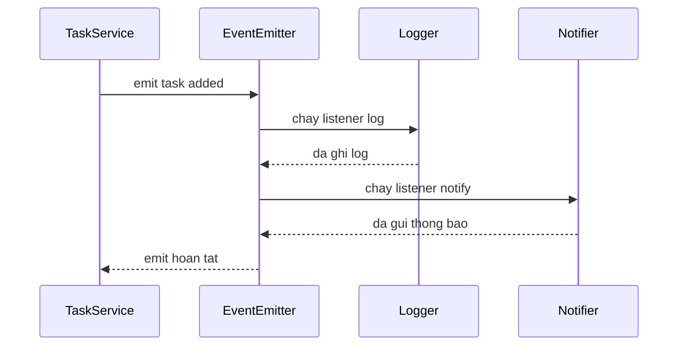

# Ngày 6 — EventEmitter & Lập trình hướng sự kiện

## 🎯 Mục tiêu ngày

- Hiểu **EventEmitter** — class lõi của Node làm nền cho rất nhiều API (streams, HTTP server, process…).
- Thành thạo các method chính: `.on()` / `.addListener()`, `.emit()`, `.once()`, `.removeListener()`, `.listenerCount()`.
- Nắm rằng listener chạy **đồng bộ** theo **thứ tự đăng ký** khi `emit`.
- Nhận ra đây chính là **Observer pattern**, và xử lý đặc biệt cho event `'error'`.
- **Project Tasks API**: tạo `src/taskEvents.js` extends `EventEmitter`, phát `task:added` / `task:done`, và gắn logger lắng nghe.

> Hôm qua ta học bắt lỗi; hôm nay ta học cách các phần trong chương trình "nói chuyện" với nhau mà không phụ thuộc cứng vào nhau. Đây là tư duy nền cho mọi thứ "reactive" trong Node.

---

## ❓ Câu hỏi cần trả lời được

1. EventEmitter là gì và vì sao nó quan trọng trong Node?
2. `.on()` khác `.once()` thế nào? Khi nào dùng cái nào?
3. Khi `emit` một event có nhiều listener, chúng chạy đồng bộ hay bất đồng bộ? Theo thứ tự nào?
4. Observer pattern là gì? EventEmitter ánh xạ vào pattern đó ra sao?
5. Event `'error'` có gì đặc biệt? Điều gì xảy ra nếu không có listener cho nó?
6. Vì sao mô hình event giúp **giảm coupling** giữa các module?

---

## 📚 Lý thuyết cốt lõi

### 1. EventEmitter — class lõi của Node

`EventEmitter` (trong module `node:events`) là một object có thể **phát ra (emit)** các event có tên, và cho phép gắn các **listener** phản ứng với event đó. Rất nhiều API của Node kế thừa từ nó: HTTP server phát `'request'`, stream phát `'data'`/`'end'`, `process` phát `'exit'`.

```js
import { EventEmitter } from "node:events";

const bus = new EventEmitter();

// Gắn listener
bus.on("greet", (name) => {
  console.log(`Xin chào, ${name}`);
});

// Phát event kèm dữ liệu
bus.emit("greet", "Node"); // -> Xin chào, Node
```

### 2. API chính

```js
const ee = new EventEmitter();

const handler = (msg) => console.log("Nhận:", msg);

ee.on("ping", handler); // .on() = .addListener(): nghe mọi lần
ee.once("ready", () => console.log("Chỉ chạy 1 lần")); // tự gỡ sau lần đầu

ee.emit("ping", "hello"); // -> Nhận: hello
ee.emit("ready"); // -> Chỉ chạy 1 lần
ee.emit("ready"); // (im lặng, listener đã bị gỡ)

console.log(ee.listenerCount("ping")); // 1
ee.removeListener("ping", handler); // gỡ thủ công (alias: .off())
console.log(ee.listenerCount("ping")); // 0
```

| Method | Công dụng |
|---|---|
| `.on(event, fn)` / `.addListener` | Gắn listener nghe **mọi** lần event phát |
| `.once(event, fn)` | Gắn listener chỉ chạy **một lần** rồi tự gỡ |
| `.emit(event, ...args)` | Phát event, truyền tham số cho listener |
| `.removeListener(event, fn)` / `.off` | Gỡ một listener cụ thể |
| `.listenerCount(event)` | Đếm số listener đang gắn cho event |

### 3. Listener chạy đồng bộ, theo thứ tự đăng ký

Khi `emit`, Node gọi **tuần tự và đồng bộ** từng listener theo đúng thứ tự đã đăng ký — không phải song song, không lùi sang tick sau.

```js
const ee = new EventEmitter();
ee.on("x", () => console.log("A"));
ee.on("x", () => console.log("B"));
ee.emit("x");
console.log("C");
// In ra: A, B, C  (A và B chạy xong trước khi tới C)
```

Vì chạy đồng bộ, một listener "nặng" sẽ chặn các listener sau. Nếu cần xử lý lâu, hãy đẩy việc nặng sang bất đồng bộ bên trong listener.

### 4. Observer pattern

EventEmitter chính là hiện thân của **Observer pattern**: một **subject** (object phát event) duy trì danh sách **observer** (các listener) và thông báo cho tất cả khi có thay đổi. Lợi ích lớn nhất là **giảm coupling**: bên phát không cần biết ai đang nghe hay họ làm gì — nó chỉ "thông báo có chuyện xảy ra". Ta có thể thêm/bớt observer (logger, notifier, metrics) mà không sửa code bên phát.

### 5. Event `'error'` đặc biệt

`'error'` là event được Node đối xử riêng: **nếu emit `'error'` mà không có listener nào, EventEmitter sẽ throw** và thường làm crash process.

```js
const ee = new EventEmitter();

ee.on("error", (err) => {
  console.error("Đã bắt lỗi:", err.message); // an toàn
});
ee.emit("error", new Error("hỏng rồi"));

// Nếu KHÔNG có listener 'error' ở trên:
// ee.emit("error", new Error("x")) → throw, có thể crash process
```

Quy tắc: với bất kỳ EventEmitter nào có khả năng phát `'error'`, **luôn gắn một listener `'error'`**.

---

## 🗺️ Sơ đồ: TaskService phát event tới nhiều listener



---

## 🛠️ Project Tasks API — Hôm nay làm gì

Hôm nay ta tách phần "thông báo" ra khỏi logic nghiệp vụ bằng EventEmitter: khi task thay đổi, ta **phát event**, và một logger độc lập **lắng nghe** để in log.

Tạo `src/taskEvents.js`:

```js
// src/taskEvents.js
import { EventEmitter } from "node:events";

class TaskEvents extends EventEmitter {}

// Một bus dùng chung cho toàn app
export const taskEvents = new TaskEvents();
```

Tạo `src/logger.js` — observer lắng nghe các event:

```js
// src/logger.js
import { taskEvents } from "./taskEvents.js";

function stamp() {
  return new Date().toISOString();
}

taskEvents.on("task:added", (task) => {
  console.log(`[${stamp()}] ➕ Đã thêm task #${task.id}: ${task.title}`);
});

taskEvents.on("task:done", (task) => {
  console.log(`[${stamp()}] ✅ Hoàn thành task #${task.id}: ${task.title}`);
});

// Luôn có listener cho 'error' để tránh crash
taskEvents.on("error", (err) => {
  console.error(`[${stamp()}] ⚠️ Lỗi task event:`, err.message);
});
```

Phát event trong `src/tasks.js` (nối tiếp các ngày trước):

```js
// src/tasks.js (trích)
import { readTasks, writeTasks } from "./store.js";
import { taskEvents } from "./taskEvents.js";
import { NotFoundError } from "./errors.js";

export async function add(title) {
  const tasks = await readTasks();
  const id = tasks.length ? Math.max(...tasks.map((t) => t.id)) + 1 : 1;
  const task = { id, title, done: false };
  tasks.push(task);
  await writeTasks(tasks);
  taskEvents.emit("task:added", task); // thông báo, không cần biết ai nghe
  return task;
}

export async function complete(id) {
  const tasks = await readTasks();
  const task = tasks.find((t) => t.id === id);
  if (!task) throw new NotFoundError(`Không có task id=${id}`);
  task.done = true;
  await writeTasks(tasks);
  taskEvents.emit("task:done", task);
  return task;
}
```

Nạp logger ở entry point để nó đăng ký listener:

```js
// src/index.js (trích)
import "./logger.js"; // chỉ cần import để gắn các listener
import { add, complete } from "./tasks.js";

await add("Học EventEmitter");
await complete(1);
```

Chạy thử:

```bash
npm start
```

---

## ✏️ Bài tập

1. Thêm event `task:removed` phát khi xoá task, và một listener trong `logger.js` in dòng log tương ứng.
2. Viết một observer thứ hai `src/notifier.js` cũng lắng nghe `task:done` và in `"🔔 Thông báo: task #N xong"`. Quan sát cả hai listener cùng chạy cho một lần `emit` — minh hoạ nhiều observer.
3. Dùng `.once()` cho event `app:ready`: phát một lần ở đầu chương trình, gắn listener in `"Khởi động xong"`, rồi emit lại lần hai và xác nhận listener không chạy lại.
4. Cố tình `emit("error", new Error("test"))` **trước khi** gắn listener `'error'`, quan sát process throw. Sau đó gắn listener `'error'` rồi thử lại để thấy khác biệt.

---

## ✅ Self-check (đáp án ngắn)

1. EventEmitter là object có thể phát event có tên và gắn listener phản ứng. Quan trọng vì nhiều API lõi của Node (HTTP server, streams, process) đều dựa trên nó.
2. `.on()` nghe **mọi** lần event phát; `.once()` chỉ chạy **một lần** rồi tự gỡ. Dùng `.once()` cho event chỉ xảy ra một lần (vd khởi tạo xong).
3. Các listener chạy **đồng bộ**, **tuần tự theo thứ tự đăng ký**, hoàn tất hết trước khi code sau `emit` chạy tiếp.
4. Observer pattern: một subject thông báo cho danh sách observer khi có thay đổi. EventEmitter là subject, mỗi listener là observer → giảm coupling.
5. Event `'error'` đặc biệt: nếu emit mà **không** có listener, EventEmitter throw và thường crash process. Vì vậy luôn gắn listener `'error'`.
6. Bên phát chỉ "thông báo có chuyện xảy ra" mà không cần biết ai nghe hay họ làm gì, nên có thể thêm/bớt listener tự do mà không sửa code bên phát → coupling thấp.
