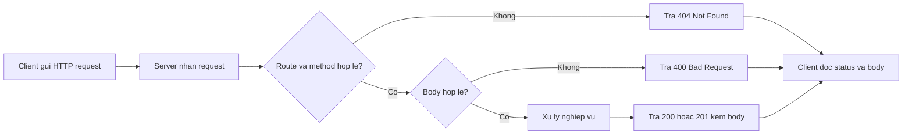

# Ngày 7 — HTTP & Nền tảng Web Service

## 🎯 Mục tiêu ngày

- Phân biệt **web service** vs **API** — quan hệ "tập con" giữa chúng.
- Hiểu hai phong cách lớn: **SOAP** (giao thức nhắn tin XML) vs **REST** (kiến trúc nhẹ).
- Nắm cơ bản về **HTTP**: request/response, header, body, method, và ý nghĩa các **status code**.
- Biết ở mức khái niệm **protocol stack 4 lớp** và cấu trúc một **SOAP message** (để so sánh).
- **Project Tasks API**: nâng raw HTTP server (từ Ngày 2) để xử lý nhiều route/method và đọc body JSON thủ công — chuẩn bị cho thiết kế REST ở Ngày 8.

> Đây là ngày lý thuyết nền. Ta chưa dùng Express (đó là Ngày 9) — mục tiêu là hiểu rõ HTTP "trần" và vì sao REST thắng thế, để khi dùng framework bạn biết nó đang giấu đi cái gì.

---

## ❓ Câu hỏi cần trả lời được

1. Web service và API khác nhau thế nào? Vì sao nói "mọi web service là API nhưng không phải API nào cũng là web service"?
2. SOAP và REST khác nhau ở điểm cốt lõi nào? Khi nào người ta vẫn chọn SOAP?
3. Một HTTP request gồm những thành phần nào? Method dùng để làm gì?
4. Các status code 200, 201, 400, 401, 404, 500 mang ý nghĩa gì?
5. Protocol stack 4 lớp của web service gồm những lớp nào? REST có cần WSDL không?
6. Vì sao REST được ưa chuộng hơn cho web API hiện đại?

---

## 📚 Lý thuyết cốt lõi

### 1. Web Service vs API

**API** (Application Programming Interface) là *bất kỳ* giao diện cho phép phần mềm này gọi phần mềm khác — kể cả thư viện chạy nội bộ, không cần mạng.

**Web service** là một *tập con* của API: nó **phụ thuộc network** và giao tiếp qua **giao thức web** (chủ yếu là HTTP). Vì vậy:

- Mọi **web service** đều là **API** (nó phơi bày một giao diện gọi được).
- Không phải **API** nào cũng là **web service** (vd một thư viện toán học gọi local thì không qua mạng).

### 2. Hai phong cách: SOAP vs REST

| Tiêu chí | SOAP | REST |
|---|---|---|
| Bản chất | **Giao thức** nhắn tin | **Kiến trúc** (architectural style) |
| Định dạng | Chỉ **XML** | JSON, XML, text… (thường JSON) |
| Hợp đồng | Chặt (WSDL mô tả service) | Lỏng, dựa trên tài nguyên + HTTP |
| Trọng lượng | Nặng, nhiều quy tắc | Nhẹ, nhanh |
| Thường dùng cho | Hệ thống enterprise, giao dịch ngặt | Web/mobile API hiện đại |

- **SOAP** là một giao thức nhắn tin với hợp đồng chặt chẽ (qua WSDL), bảo mật và transaction phong phú — vẫn xuất hiện ở ngân hàng, viễn thông, hệ thống cũ.
- **REST** không phải giao thức mà là *phong cách kiến trúc*: dùng chính HTTP và các method của nó để thao tác trên **tài nguyên** (resource). Nhẹ, dễ test, dễ scale.

**Sync vs async communication**: giao tiếp **đồng bộ** thì client gửi request rồi *chờ* response (phổ biến nhất với HTTP request/response). Giao tiếp **bất đồng bộ** thì client không chờ ngay — thường qua message queue/webhook, phản hồi đến sau.

### 3. HTTP cơ bản

HTTP là giao thức request/response. Một **request** gồm:

- **Method**: ý định thao tác — `GET` (đọc), `POST` (tạo), `PUT`/`PATCH` (sửa), `DELETE` (xoá).
- **URL/path**: tài nguyên muốn tác động (vd `/tasks`).
- **Header**: metadata (vd `Content-Type: application/json`, `Authorization`).
- **Body**: dữ liệu kèm theo (thường ở `POST`/`PUT`).

Một **response** gồm **status code**, **header**, và **body**.

```
POST /tasks HTTP/1.1
Host: localhost:3000
Content-Type: application/json

{ "title": "Học HTTP" }
```

### 4. Status code (giới thiệu)

Status code báo cho client kết quả xử lý. Sẽ đào sâu ở Ngày 8; hôm nay nắm ý nghĩa cơ bản:

| Code | Ý nghĩa | Khi nào dùng |
|---|---|---|
| `200` OK | Thành công | GET/PUT trả dữ liệu OK |
| `201` Created | Đã tạo tài nguyên | POST tạo mới thành công |
| `400` Bad Request | Client gửi dữ liệu sai | JSON hỏng, thiếu field |
| `401` Unauthorized | Chưa xác thực | Thiếu/ sai token đăng nhập |
| `404` Not Found | Không tìm thấy tài nguyên | `/tasks/999` không tồn tại |
| `500` Internal Server Error | Lỗi phía server | Bug/ ngoại lệ không lường |

Nhóm chữ số đầu nói lên loại: `2xx` thành công, `4xx` lỗi do client, `5xx` lỗi do server.

### 5. Protocol stack 4 lớp & SOAP message (khái niệm)

Mô hình kinh điển của web service có **4 lớp** (chỉ ở mức khái niệm):

| Lớp | Vai trò | Công nghệ |
|---|---|---|
| Service Transport | Vận chuyển message | **HTTP** |
| XML Messaging | Mã hoá message | **SOAP** (XML) |
| Service Description | Mô tả hợp đồng service | **WSDL** |
| Service Discovery | Tìm/đăng ký service | **UDDI** |

> REST **không cần** WSDL/UDDI: nó dựa trực tiếp vào HTTP và quy ước tài nguyên, nên đơn giản hơn nhiều so với stack đầy đủ của SOAP.

Một **SOAP message** có cấu trúc (đề cập ngắn để so sánh):

- **Envelope** — *bắt buộc*, bao toàn bộ message.
- **Header** — *tuỳ chọn*, chứa metadata (auth, transaction).
- **Body** — *bắt buộc*, chứa nội dung thực sự.

### 6. Vì sao REST được ưa chuộng

- **Platform-independent**: chỉ cần nói được HTTP là tích hợp được.
- Hỗ trợ nhiều định dạng (**JSON**/XML), thường dùng JSON nhẹ.
- **Nhẹ và nhanh** hơn SOAP (không bộ khung XML đồ sộ).
- **Dễ test** (chỉ cần `curl`/trình duyệt) và **dễ scale**.

---

## 🗺️ Sơ đồ: Luồng HTTP request/response



---

## 🛠️ Project Tasks API — Hôm nay làm gì

Ôn lại raw HTTP server của Ngày 2 và nâng nó: xử lý **nhiều route + method** và **đọc body JSON thủ công** bằng cách gom các data chunks. Đây là bước đệm trước khi thiết kế REST ở Ngày 8.

```js
// src/server.js (nâng từ Ngày 2)
import { createServer } from "node:http";
import { getAll, add } from "./tasks.js";

// Đọc body JSON thủ công: gom từng chunk rồi parse
function readJsonBody(req) {
  return new Promise((resolve, reject) => {
    let raw = "";
    req.on("data", (chunk) => {
      raw += chunk; // nối từng mảnh dữ liệu
    });
    req.on("end", () => {
      if (!raw) return resolve({});
      try {
        resolve(JSON.parse(raw));
      } catch {
        reject(new Error("JSON không hợp lệ"));
      }
    });
    req.on("error", reject);
  });
}

function sendJson(res, status, data) {
  res.writeHead(status, { "Content-Type": "application/json" });
  res.end(JSON.stringify(data));
}

const server = createServer(async (req, res) => {
  const { method, url } = req;

  // GET /tasks → liệt kê
  if (method === "GET" && url === "/tasks") {
    return sendJson(res, 200, await getAll());
  }

  // POST /tasks → tạo mới
  if (method === "POST" && url === "/tasks") {
    try {
      const body = await readJsonBody(req);
      if (!body.title) {
        return sendJson(res, 400, { error: "Thiếu title" });
      }
      const task = await add(body.title);
      return sendJson(res, 201, task); // 201 Created
    } catch (err) {
      return sendJson(res, 400, { error: err.message });
    }
  }

  // Không khớp route nào
  sendJson(res, 404, { error: "Không tìm thấy route" });
});

server.listen(3000, () => {
  console.log("Server chạy ở http://localhost:3000");
});
```

> ⚠️ Server này **chưa có** xác thực — bất kỳ ai gọi được cũng tạo/đọc task. Ổn cho học tập ở localhost, nhưng sẽ thêm auth ở Ngày 11 trước khi nghĩ tới production.

Thử nhanh:

```bash
# Liệt kê tasks
curl localhost:3000/tasks

# Tạo task mới
curl -s -X POST localhost:3000/tasks \
  -H 'Content-Type: application/json' \
  -d '{"title":"Học REST"}'
```

---

## ✏️ Bài tập

1. Thêm route `GET /tasks/:id` thủ công: parse `id` từ `url` (vd tách chuỗi sau `/tasks/`), trả task tương ứng hoặc `404` nếu không có.
2. Thêm `DELETE /tasks/:id` xoá task theo id, trả `204 No Content` khi thành công, `404` khi không tìm thấy. Tra cứu ý nghĩa `204`.
3. Khi client gửi `Content-Type` không phải `application/json` cho `POST /tasks`, trả `415 Unsupported Media Type`. Giải thích vì sao `415` hợp lý hơn `400` ở đây.
4. Viết bằng lời: liệt kê 3 việc Express sẽ làm hộ bạn mà hôm nay bạn phải tự code (gợi ý: routing, parse body, gửi response).

---

## ✅ Self-check (đáp án ngắn)

1. API là mọi giao diện gọi phần mềm (kể cả local); web service là tập con của API, phụ thuộc network và dùng giao thức web (HTTP). Nên mọi web service là API, nhưng API local thì không phải web service.
2. SOAP là **giao thức** nhắn tin XML, hợp đồng chặt (WSDL); REST là **kiến trúc** nhẹ dùng HTTP trên tài nguyên. SOAP vẫn được chọn cho hệ enterprise cần transaction/bảo mật ngặt và hợp đồng cứng.
3. HTTP request gồm method, URL/path, header và body. Method báo ý định thao tác: GET đọc, POST tạo, PUT/PATCH sửa, DELETE xoá.
4. `200` OK; `201` đã tạo tài nguyên; `400` client gửi sai; `401` chưa xác thực; `404` không tìm thấy; `500` lỗi phía server. (`2xx` ok, `4xx` lỗi client, `5xx` lỗi server.)
5. 4 lớp: Service Transport (HTTP), XML Messaging (SOAP), Service Description (WSDL), Service Discovery (UDDI). REST **không cần** WSDL/UDDI — nó dựa thẳng vào HTTP và quy ước tài nguyên.
6. REST platform-independent, hỗ trợ JSON/XML, nhẹ và nhanh hơn SOAP, dễ test và dễ scale → phù hợp web/mobile API hiện đại.
