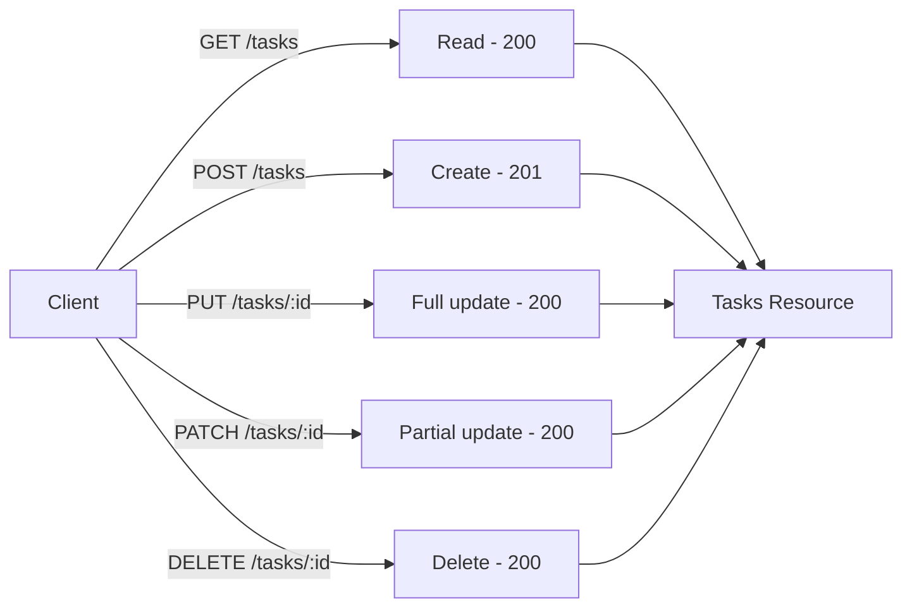

# Ngày 8 — Thiết kế REST API

## 🎯 Mục tiêu ngày

- Hiểu các ràng buộc cốt lõi của **REST**: client-server, stateless, dùng HTTP methods để thao tác trên **resource**.
- Ánh xạ rõ ràng **HTTP methods ↔ CRUD** và chọn đúng **status code** cho từng tình huống.
- Thiết kế **resource URL** đúng chuẩn (danh từ số nhiều, không động từ) và biết cách làm **API versioning**.
- Phân biệt **idempotency** giữa các method và vì sao nó quan trọng khi retry.
- **Project Tasks API**: định nghĩa đầy đủ bộ REST endpoints, thống nhất response format JSON, cài đặt bằng một router raw HTTP đơn giản.

> Đến hôm nay project mới chỉ là vài route rời rạc xử lý bằng raw `http`. Day 8 là ngày **thiết kế** — chốt hợp đồng API trước khi Day 9 migrate sang Express. Thiết kế tốt ở đây thì các ngày sau chỉ là thay "động cơ" bên dưới.

---

## ❓ Câu hỏi cần trả lời được

1. REST khác SOAP ở những điểm nào? "RESTful" nghĩa là gì?
2. "Stateless" nghĩa là gì? Vì sao nó giúp API dễ scale ngang?
3. Mỗi HTTP method ánh xạ với thao tác CRUD nào? `PUT` khác `PATCH` ra sao?
4. Khi tạo mới thành công thì trả status code nào? Khi method không được phép trên resource thì trả mã gì?
5. Vì sao URL nên là danh từ số nhiều (`/tasks`) thay vì động từ (`/getTasks`)?
6. Idempotency là gì? Method nào idempotent, method nào không?

---

## 📚 Lý thuyết cốt lõi

### 1. REST là gì

**REST** (Representational State Transfer) là một phong cách kiến trúc cho API trên nền HTTP. Một API được gọi là **RESTful** khi tuân theo các ràng buộc chính:

- **Client-server** — tách giao diện (client) khỏi lưu trữ/xử lý (server). Hai bên tiến hoá độc lập.
- **Stateless** — server không lưu phiên giữa các request; mỗi request mang đủ thông tin để xử lý.
- **Resource-based** — mọi thứ là *resource*, định danh bằng URL, thao tác bằng HTTP methods.
- **Uniform interface** — dùng chung bộ method và status code chuẩn của HTTP.

Khác với **SOAP** (giao thức nặng, cần file mô tả `WSDL`, dữ liệu bọc trong XML envelope), REST nhẹ hơn, thường dùng JSON và tận dụng trực tiếp ngữ nghĩa có sẵn của HTTP.

| Tiêu chí | SOAP | REST |
|---|---|---|
| Bản chất | Giao thức nghiêm ngặt | Phong cách kiến trúc |
| Định dạng | Chỉ XML | JSON, XML, text… |
| Mô tả hợp đồng | Cần `WSDL` | Không bắt buộc |
| Trạng thái | Có thể stateful | Stateless |
| Độ nhẹ | Nặng | Nhẹ |

### 2. Statelessness

Server **không lưu** trạng thái phiên giữa các request. Mỗi request phải tự mang đủ context (token, tham số, body) để được xử lý độc lập.

```text
Request 1: GET /tasks        (Authorization: Bearer abc)  → xử lý độc lập
Request 2: GET /tasks/5      (Authorization: Bearer abc)  → xử lý độc lập
```

Lợi ích: bất kỳ instance server nào cũng xử lý được mọi request → dễ đặt sau load balancer và **scale ngang**. Đánh đổi: client phải gửi lại context mỗi lần (vd token ở mỗi request).

### 3. HTTP methods ↔ CRUD

| Method | CRUD | Mô tả | Idempotent |
|---|---|---|---|
| `GET` | Read | Lấy resource, không đổi dữ liệu | Có |
| `POST` | Create | Tạo resource mới | Không |
| `PUT` | Update | Thay **toàn bộ** resource | Có |
| `PATCH` | Update | Cập nhật **một phần** resource | Không bắt buộc |
| `DELETE` | Delete | Xoá resource | Có |

`PUT` thay nguyên trạng thái resource (gửi đầy đủ các field); `PATCH` chỉ gửi phần muốn đổi.

```text
PUT /tasks/5      { "title": "Học REST", "done": true }   ← gửi đủ field
PATCH /tasks/5    { "done": true }                          ← chỉ field cần đổi
```

### 4. Status codes

Chọn đúng status code giúp client xử lý phản hồi mà không cần đọc body.

| Code | Ý nghĩa | Khi nào dùng |
|---|---|---|
| `200 OK` | Thành công | GET/PUT/PATCH/DELETE thành công |
| `201 Created` | Đã tạo | POST tạo resource mới |
| `202 Accepted` | Đã nhận | Xử lý bất đồng bộ, chưa xong |
| `400 Bad Request` | Sai dữ liệu | Body/tham số không hợp lệ |
| `401 Unauthorized` | Chưa xác thực | Thiếu/sai token |
| `404 Not Found` | Không tìm thấy | Resource không tồn tại |
| `405 Method Not Allowed` | Method không cho phép | Method sai trên resource |
| `409 Conflict` | Xung đột | Trùng dữ liệu, vi phạm ràng buộc |
| `500 Internal Server Error` | Lỗi server | Lỗi không lường trước |

### 5. Resource URL & versioning

Quy ước thiết kế URL:

- Dùng **danh từ số nhiều**: `/tasks`, không phải `/task` hay `/getTasks`.
- **Không** nhét động từ vào URL — động từ đã nằm ở HTTP method.
- Resource con: `/tasks/:id` để chỉ một task cụ thể.

```text
✅ GET    /tasks          → liệt kê
✅ GET    /tasks/5        → lấy task 5
✅ POST   /tasks          → tạo mới
❌ GET    /getAllTasks    → động từ thừa
❌ POST   /tasks/create   → động từ thừa
```

**API versioning** để thay đổi không phá vỡ client cũ. Phổ biến nhất là version trong path:

```text
/api/v1/tasks      ← version qua URL (dễ thấy, dễ cache)
```

Hoặc qua header `Accept: application/vnd.tasks.v1+json` (gọn URL nhưng khó debug hơn).

### 6. Idempotency

Một thao tác **idempotent** khi gọi nhiều lần cho **cùng kết quả** như gọi một lần.

- `GET`, `PUT`, `DELETE` → idempotent. Gọi `DELETE /tasks/5` hai lần thì sau cả hai lần task 5 đều biến mất.
- `POST` → **không** idempotent. Gọi `POST /tasks` hai lần tạo ra hai task.

Điều này quan trọng khi client **retry** lúc mạng chập chờn: retry `PUT`/`DELETE` an toàn, còn retry `POST` có thể tạo bản ghi trùng.

---

## 🗺️ Sơ đồ: Ánh xạ CRUD sang REST endpoints



---

## 🛠️ Project Tasks API — Hôm nay làm gì

Hôm nay ta **chốt hợp đồng API** cho Tasks và cài đặt bằng một router raw HTTP nhỏ (Day 9 sẽ thay bằng Express).

Bộ endpoints đầy đủ:

| Method | Path | Mô tả | Success |
|---|---|---|---|
| `GET` | `/api/v1/tasks` | Liệt kê tasks | `200` |
| `GET` | `/api/v1/tasks/:id` | Lấy 1 task | `200` / `404` |
| `POST` | `/api/v1/tasks` | Tạo task | `201` / `400` |
| `PUT` | `/api/v1/tasks/:id` | Thay toàn bộ task | `200` / `404` |
| `PATCH` | `/api/v1/tasks/:id` | Cập nhật một phần | `200` / `404` |
| `DELETE` | `/api/v1/tasks/:id` | Xoá task | `200` / `404` |

Thống nhất **response format** JSON cho cả thành công lẫn lỗi:

```js
// src/respond.js — helper trả JSON nhất quán
export function sendJson(res, status, payload) {
  const body = JSON.stringify(payload);
  res.writeHead(status, { "Content-Type": "application/json" });
  res.end(body);
}

export const ok = (res, data) => sendJson(res, 200, { data });
export const created = (res, data) => sendJson(res, 201, { data });
export const fail = (res, status, message) =>
  sendJson(res, status, { error: message });
```

Router raw HTTP đơn giản tách path và method:

```js
// src/server.js
import { createServer } from "node:http";
import { ok, created, fail } from "./respond.js";
import * as store from "./tasks.js";

const PREFIX = "/api/v1/tasks";

function readBody(req) {
  return new Promise((resolve, reject) => {
    let raw = "";
    req.on("data", (chunk) => (raw += chunk));
    req.on("end", () => {
      try {
        resolve(raw ? JSON.parse(raw) : {});
      } catch {
        reject(new Error("JSON không hợp lệ"));
      }
    });
  });
}

const server = createServer(async (req, res) => {
  const { method, url } = req;

  // GET /api/v1/tasks
  if (method === "GET" && url === PREFIX) {
    return ok(res, store.getAll());
  }

  // POST /api/v1/tasks
  if (method === "POST" && url === PREFIX) {
    try {
      const body = await readBody(req);
      if (!body.title) return fail(res, 400, "Thiếu title");
      return created(res, store.add(body.title));
    } catch (err) {
      return fail(res, 400, err.message);
    }
  }

  // GET /api/v1/tasks/:id
  const match = url.match(/^\/api\/v1\/tasks\/(\d+)$/);
  if (match && method === "GET") {
    const task = store.getById(Number(match[1]));
    return task ? ok(res, task) : fail(res, 404, "Không tìm thấy task");
  }

  // DELETE /api/v1/tasks/:id
  if (match && method === "DELETE") {
    const removed = store.remove(Number(match[1]));
    return removed ? ok(res, removed) : fail(res, 404, "Không tìm thấy task");
  }

  // Path tồn tại nhưng method không hỗ trợ
  if (url === PREFIX || match) {
    return fail(res, 405, "Method Not Allowed");
  }

  return fail(res, 404, "Route không tồn tại");
});

server.listen(3000, () => console.log("Tasks API chạy ở cổng 3000"));
```

Thử nhanh:

```bash
curl -s localhost:3000/api/v1/tasks
curl -s -X POST localhost:3000/api/v1/tasks \
  -H 'Content-Type: application/json' -d '{"title":"Học REST"}'
curl -s localhost:3000/api/v1/tasks/1
```

---

## ✏️ Bài tập

1. Thêm xử lý `PUT /api/v1/tasks/:id` (thay toàn bộ task) và `PATCH /api/v1/tasks/:id` (chỉ đổi field gửi lên). Trả `404` nếu id không tồn tại.
2. Viết một bảng (trong file `API.md` hoặc comment) liệt kê mọi endpoint kèm method, mô tả, và status code khả dĩ — chính là "hợp đồng API".
3. Chứng minh idempotency bằng thực nghiệm: gọi `DELETE /api/v1/tasks/1` hai lần và `POST /api/v1/tasks` hai lần, quan sát khác biệt về kết quả và status code.
4. Thêm versioning thứ hai: cho phép truy cập cùng resource qua header `Accept` chứa `v2`, trả thêm field `createdAt` so với `v1`.

---

## ✅ Self-check (đáp án ngắn)

1. REST là phong cách kiến trúc nhẹ trên HTTP dùng JSON, không cần `WSDL`; SOAP là giao thức nặng dùng XML envelope. "RESTful" nghĩa là tuân theo các ràng buộc REST (stateless, resource-based, uniform interface).
2. Stateless: server không lưu phiên giữa request, mỗi request mang đủ context. Nhờ vậy instance nào cũng xử lý được mọi request → dễ scale ngang sau load balancer.
3. `GET`=read, `POST`=create, `PUT`=full update, `PATCH`=partial update, `DELETE`=delete. `PUT` thay toàn bộ resource (gửi đủ field); `PATCH` chỉ đổi phần gửi lên.
4. Tạo mới thành công → `201 Created`. Method không được phép trên resource → `405 Method Not Allowed`.
5. URL nên là danh từ vì động từ đã nằm ở HTTP method; dùng danh từ số nhiều giữ interface đồng nhất và tránh trùng lặp ngữ nghĩa.
6. Idempotent: gọi nhiều lần cho cùng kết quả như một lần. `GET`/`PUT`/`DELETE` idempotent; `POST` không (retry có thể tạo bản ghi trùng).
