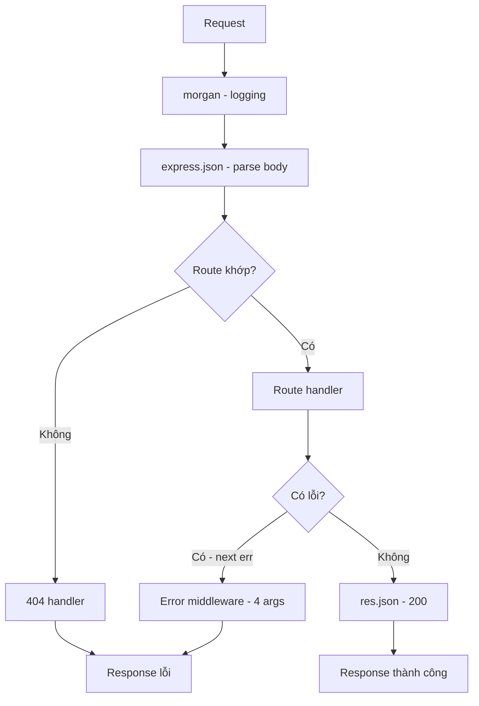

# Ngày 9 — Express & Middleware

## 🎯 Mục tiêu ngày

- Hiểu **Express** là gì và vì sao nó phổ biến cho web/API trên Node.
- Nắm khái niệm **middleware**: hàm `(req, res, next)` chạy giữa request và business logic.
- Hiểu **middleware chain** — thứ tự đăng ký quyết định luồng chạy; vai trò của `next()`.
- Phân biệt middleware **built-in** (`express.json`), **third-party** (`morgan`, `cors`), và **error-handling** (chữ ký 4 tham số).
- Biết tách **app** và **server** để dễ test và bảo trì.
- **Project Tasks API**: migrate từ raw HTTP sang Express với `src/app.js` (routes + middleware) và `src/server.js` (listen).

> Day 8 ta đã chốt hợp đồng REST. Hôm nay thay "động cơ" raw `http` bằng Express — giữ nguyên endpoints, nhưng code gọn hơn nhiều và mở đường cho auth, validation ở các ngày sau.

---

## ❓ Câu hỏi cần trả lời được

1. Express giải quyết những phiền toái gì so với module `http` thuần?
2. Middleware là gì? Chữ ký `(req, res, next)` có ý nghĩa gì?
3. Vì sao **thứ tự** đăng ký middleware lại quan trọng? Điều gì xảy ra nếu quên gọi `next()`?
4. `express.json()` làm gì? Khác gì với việc tự đọc body như Day 7?
5. Error-handling middleware khác middleware thường ở điểm nào?
6. Vì sao nên tách `app.js` và `server.js`?

---

## 📚 Lý thuyết cốt lõi

### 1. Express là gì

**Express** là web framework tối giản, phổ biến nhất cho Node. Nó bọc module `http` và cung cấp:

- **Routing** gọn gàng theo method + path: `app.get("/tasks", ...)`.
- Cơ chế **middleware** để tách các quan tâm (logging, parse body, auth…).
- Tiện ích trên `req`/`res`: `req.params`, `req.body`, `res.json()`, `res.status()`.

So với raw `http`, ta không còn phải tự `match` regex cho từng route hay tự đọc body thủ công.

### 2. Middleware

**Middleware** là hàm chạy *giữa* lúc nhận request và lúc trả response. Chữ ký:

```js
function middleware(req, res, next) {
  // làm gì đó với req/res
  next(); // chuyển quyền cho middleware/handler kế tiếp
}
```

- `req` — đối tượng request (đọc/ghi được, có thể gắn thêm dữ liệu như `req.user`).
- `res` — đối tượng response (gửi dữ liệu về client).
- `next` — gọi để chuyển sang middleware tiếp theo. **Không gọi** `next()` (và cũng không gửi response) thì request "treo".

Dùng cho: logging, parse body, xác thực, kiểm tra quyền, xử lý lỗi.

### 3. Middleware chain & thứ tự

Các middleware tạo thành một **chuỗi** chạy theo đúng thứ tự đăng ký bằng `app.use()` hoặc gắn vào route. Mỗi mắt xích quyết định: xử lý rồi gọi `next()`, hoặc kết thúc bằng cách gửi response.

```js
app.use(logger);        // 1. chạy trước
app.use(express.json()); // 2. parse body
app.get("/tasks", handler); // 3. handler cuối
```

Nếu đặt `express.json()` **sau** handler đọc `req.body`, thì `req.body` sẽ là `undefined` → thứ tự sai làm hỏng logic. Quên `next()` trong một middleware giữa chuỗi → request không bao giờ tới handler.

### 4. Built-in & third-party middleware

```js
import express from "express";
import morgan from "morgan"; // logging request
import cors from "cors";     // bật Cross-Origin Resource Sharing

const app = express();

app.use(express.json()); // built-in: parse JSON body vào req.body
app.use(morgan("dev"));  // third-party: log mỗi request
app.use(cors());         // third-party: cho phép cross-origin
```

`express.json()` tự đọc stream body, parse JSON, gán vào `req.body` — thay cho cả đoạn `readBody` thủ công ở Day 7/8.

### 5. Error-handling middleware

Middleware xử lý lỗi có **chữ ký đặc biệt 4 tham số** `(err, req, res, next)`. Express nhận diện nó nhờ đủ 4 tham số và chỉ gọi nó khi có lỗi được chuyển tới (qua `next(err)` hoặc lỗi đồng bộ trong handler).

```js
// Đặt CUỐI CÙNG, sau mọi route
function errorHandler(err, req, res, next) {
  console.error(err);
  res.status(err.status || 500).json({ error: err.message || "Lỗi server" });
}
app.use(errorHandler);
```

| | Middleware thường | Error-handling |
|---|---|---|
| Tham số | `(req, res, next)` | `(err, req, res, next)` |
| Khi nào chạy | Mọi request | Chỉ khi có lỗi |
| Vị trí đăng ký | Bất kỳ (theo thứ tự) | Cuối cùng |

### 6. Tách app và server

Tách thành hai file:

- `src/app.js` — tạo `app`, đăng ký middleware + routes + error handler, **export app** (không listen).
- `src/server.js` — import app và gọi `app.listen()`.

Lợi ích: test có thể import `app` rồi gửi request giả (vd với `supertest`) **mà không cần mở cổng thật** → test nhanh, không xung đột port; production thì `server.js` lo việc lắng nghe.

---

## 🗺️ Sơ đồ: Request đi qua middleware chain



---

## 🛠️ Project Tasks API — Hôm nay làm gì

Migrate Tasks API sang Express, giữ nguyên hợp đồng REST từ Day 8.

```bash
npm install express morgan
```

`src/app.js` — đăng ký middleware, routes CRUD, error handler, export app:

```js
// src/app.js
import express from "express";
import morgan from "morgan";
import * as store from "./tasks.js";

const app = express();

app.use(morgan("dev"));   // log request
app.use(express.json());  // parse JSON body → req.body

const router = express.Router();

// GET /tasks
router.get("/", (req, res) => {
  res.json({ data: store.getAll() });
});

// GET /tasks/:id
router.get("/:id", (req, res) => {
  const task = store.getById(Number(req.params.id));
  if (!task) return res.status(404).json({ error: "Không tìm thấy task" });
  res.json({ data: task });
});

// POST /tasks
router.post("/", (req, res) => {
  const { title } = req.body;
  if (!title) return res.status(400).json({ error: "Thiếu title" });
  res.status(201).json({ data: store.add(title) });
});

// PATCH /tasks/:id
router.patch("/:id", (req, res) => {
  const updated = store.update(Number(req.params.id), req.body);
  if (!updated) return res.status(404).json({ error: "Không tìm thấy task" });
  res.json({ data: updated });
});

// DELETE /tasks/:id
router.delete("/:id", (req, res) => {
  const removed = store.remove(Number(req.params.id));
  if (!removed) return res.status(404).json({ error: "Không tìm thấy task" });
  res.json({ data: removed });
});

app.use("/api/v1/tasks", router);

// 404 cho route không khớp
app.use((req, res) => {
  res.status(404).json({ error: "Route không tồn tại" });
});

// Error-handling middleware (4 tham số) — đặt cuối cùng
app.use((err, req, res, next) => {
  console.error(err);
  res.status(err.status || 500).json({ error: err.message || "Lỗi server" });
});

export default app;
```

`src/server.js` — chỉ lo lắng nghe cổng:

```js
// src/server.js
import app from "./app.js";

const PORT = 3000;
app.listen(PORT, () => console.log(`Tasks API chạy ở cổng ${PORT}`));
```

Chạy & thử:

```bash
node src/server.js

curl -s localhost:3000/api/v1/tasks
curl -s -X POST localhost:3000/api/v1/tasks \
  -H 'Content-Type: application/json' -d '{"title":"Học Express"}'
```

---

## ✏️ Bài tập

1. Viết middleware tự làm `requestTime` gán `req.startTime = Date.now()` và một middleware sau đó log thời gian xử lý. Quan sát tác động của thứ tự đăng ký.
2. Thêm `PUT /api/v1/tasks/:id` (thay toàn bộ) bên cạnh `PATCH`. Trả `400` nếu thiếu field bắt buộc, `404` nếu không tìm thấy.
3. Cố tình ném lỗi trong một handler (`throw new Error("test")`) và xác nhận error-handling middleware bắt được, trả `500` với message JSON.
4. Cài `supertest`, viết một test import `app` từ `app.js` (không listen) để kiểm tra `GET /api/v1/tasks` trả `200`. Giải thích vì sao tách app/server giúp test dễ hơn.

---

## ✅ Self-check (đáp án ngắn)

1. Express bọc module `http`, cho routing gọn theo method+path, cơ chế middleware, và tiện ích `req.params`/`req.body`/`res.json` — đỡ phải tự match regex và đọc body thủ công.
2. Middleware là hàm chạy giữa request và business logic; `req` là request, `res` là response, `next` chuyển quyền cho mắt xích kế tiếp.
3. Middleware chạy theo thứ tự đăng ký nên đặt sai (vd `express.json()` sau handler) làm hỏng logic; quên `next()` thì request treo, không tới được handler.
4. `express.json()` đọc body stream, parse JSON và gán vào `req.body` — thay cho đoạn đọc body thủ công ở Day 7.
5. Error-handling middleware có 4 tham số `(err, req, res, next)`, chỉ chạy khi có lỗi, và phải đặt cuối cùng.
6. Tách `app.js` (export app) và `server.js` (listen) giúp test import app gửi request giả mà không mở cổng thật, và tách bạch cấu hình app khỏi việc lắng nghe.
