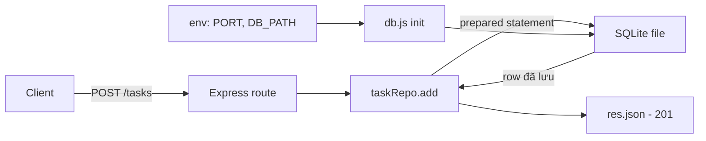

# Ngày 10 — Env/Config & Database với SQLite

## 🎯 Mục tiêu ngày

- Hiểu **`process.env`** và biến môi trường; vai trò của **`NODE_ENV`** (development/production/test).
- Nạp cấu hình từ file `.env` bằng **`dotenv`** hoặc cờ built-in **`--env-file`** (Node 20.6+).
- Nắm nguyên tắc **12-factor config**: tách config khỏi code, không commit secret.
- Dùng **SQLite** qua **`better-sqlite3`**: API đồng bộ, nhẹ, không cần server DB riêng.
- Viết CRUD thật bằng **prepared statements** để chống **SQL injection**.
- **Project Tasks API**: nối Express vào SQLite — `src/db.js` khởi tạo DB, `src/taskRepo.js` chứa CRUD, đọc `PORT`/`DB_PATH` từ env.

> Đến nay store vẫn là mảng trong bộ nhớ — restart là mất sạch. Hôm nay dữ liệu được lưu bền vào SQLite, và cấu hình (port, đường dẫn DB, secret) được tách khỏi code đúng chuẩn 12-factor.

---

## ❓ Câu hỏi cần trả lời được

1. `process.env` là gì? `NODE_ENV` thường nhận những giá trị nào và dùng để làm gì?
2. `dotenv` và cờ `--env-file` của Node khác nhau ra sao? Khi nào dùng cái nào?
3. Vì sao không nên commit file `.env`? "Tách config khỏi code" mang lại lợi ích gì?
4. `better-sqlite3` khác các driver DB khác ở điểm nào? "Synchronous API" có nghĩa gì ở đây?
5. Prepared statement là gì và vì sao nó chống được SQL injection?

---

## 📚 Lý thuyết cốt lõi

### 1. `process.env` & `NODE_ENV`

`process.env` là object chứa **biến môi trường** của tiến trình Node. Mọi giá trị đều là **string**.

```js
const port = process.env.PORT || 3000;     // fallback nếu chưa set
const env = process.env.NODE_ENV || "development";
```

`NODE_ENV` là quy ước phổ biến để báo môi trường đang chạy:

- `development` — máy lập trình, bật log chi tiết.
- `production` — chạy thật, tối ưu hiệu năng, ẩn chi tiết lỗi.
- `test` — khi chạy test, thường dùng DB riêng/tạm.

### 2. `.env`, `dotenv` và `--env-file`

Thay vì set biến môi trường thủ công, ta gom vào file `.env`:

```bash
# .env
PORT=4000
DB_PATH=./data/tasks.db
NODE_ENV=development
```

**Cách A — thư viện `dotenv`** (chạy được mọi version Node):

```bash
npm install dotenv
```

```js
// src/server.js — nạp .env vào process.env ở đầu file
import "dotenv/config";
console.log(process.env.PORT); // "4000"
```

**Cách B — cờ built-in `--env-file`** (Node 20.6+, không cần cài gì):

```bash
node --env-file=.env src/server.js
```

| | `dotenv` | `--env-file` |
|---|---|---|
| Cần cài thêm | Có | Không |
| Phiên bản Node | Mọi version | 20.6+ |
| Cách dùng | `import "dotenv/config"` | Cờ khi chạy |

### 3. 12-factor config

Nguyên tắc **12-factor app** khuyên **tách config khỏi code**:

- Config (port, URL DB, secret) lấy từ **môi trường**, không hardcode trong source.
- **Không commit secret**: thêm `.env` vào `.gitignore`, chỉ commit file mẫu `.env.example` (không chứa giá trị thật).

```bash
# .gitignore
.env
node_modules/
data/
```

Lợi ích: cùng một codebase chạy được nhiều môi trường (dev/staging/prod) chỉ bằng cách đổi biến môi trường, và secret không bị lộ qua git history.

### 4. SQLite với `better-sqlite3`

**SQLite** là CSDL nhúng — toàn bộ DB nằm trong **một file**, không cần chạy server riêng. Hợp cho học tập, prototype, và nhiều ứng dụng nhỏ/vừa.

**`better-sqlite3`** cung cấp **API đồng bộ** (synchronous): các lệnh query trả kết quả trực tiếp, không cần callback/Promise. Vì SQLite đọc file cục bộ rất nhanh, kiểu đồng bộ này đơn giản và đủ nhanh cho phần lớn trường hợp.

```js
import Database from "better-sqlite3";

const db = new Database("tasks.db");

// Tạo bảng nếu chưa có
db.exec(`
  CREATE TABLE IF NOT EXISTS tasks (
    id INTEGER PRIMARY KEY AUTOINCREMENT,
    title TEXT NOT NULL,
    done INTEGER NOT NULL DEFAULT 0
  )
`);

const rows = db.prepare("SELECT * FROM tasks").all(); // trả mảng ngay
```

### 5. Prepared statements & SQL injection

**Prepared statement** tách *câu lệnh SQL* khỏi *dữ liệu*: ta viết SQL với dấu giữ chỗ `?`, rồi truyền giá trị riêng. DB coi giá trị thuần là dữ liệu, **không** diễn giải nó như SQL.

```js
// ✅ An toàn — giá trị truyền qua placeholder
const insert = db.prepare("INSERT INTO tasks (title) VALUES (?)");
insert.run(title);

// ❌ Nguy hiểm — nối chuỗi trực tiếp → SQL injection
db.exec(`INSERT INTO tasks (title) VALUES ('${title}')`);
```

Nếu nối chuỗi, một `title` như `'); DROP TABLE tasks; --` có thể phá DB. Với prepared statement, chuỗi đó chỉ được lưu như một title bình thường.

---

## 🗺️ Sơ đồ: Luồng request từ Express tới SQLite



---

## 🛠️ Project Tasks API — Hôm nay làm gì

Thay store in-memory bằng SQLite, đọc cấu hình từ env.

```bash
npm install better-sqlite3
```

`src/db.js` — khởi tạo DB và bảng, đọc đường dẫn từ env:

```js
// src/db.js
import Database from "better-sqlite3";

const DB_PATH = process.env.DB_PATH || "./tasks.db";

const db = new Database(DB_PATH);

db.exec(`
  CREATE TABLE IF NOT EXISTS tasks (
    id INTEGER PRIMARY KEY AUTOINCREMENT,
    title TEXT NOT NULL,
    done INTEGER NOT NULL DEFAULT 0
  )
`);

export default db;
```

`src/taskRepo.js` — CRUD bằng prepared statements:

```js
// src/taskRepo.js
import db from "./db.js";

const stmts = {
  all: db.prepare("SELECT * FROM tasks"),
  byId: db.prepare("SELECT * FROM tasks WHERE id = ?"),
  insert: db.prepare("INSERT INTO tasks (title) VALUES (?)"),
  setDone: db.prepare("UPDATE tasks SET done = ? WHERE id = ?"),
  remove: db.prepare("DELETE FROM tasks WHERE id = ?"),
};

export const getAll = () => stmts.all.all();

export const getById = (id) => stmts.byId.get(id);

export function add(title) {
  const info = stmts.insert.run(title); // run trả lastInsertRowid
  return getById(info.lastInsertRowid);
}

export function setDone(id, done) {
  const info = stmts.setDone.run(done ? 1 : 0, id);
  return info.changes ? getById(id) : null; // null nếu id không tồn tại
}

export function remove(id) {
  const task = getById(id);
  stmts.remove.run(id);
  return task; // null nếu vốn không có
}
```

Nối vào route Express (thay `store` của Day 9 bằng `taskRepo`):

```js
// src/app.js (trích)
import * as repo from "./taskRepo.js";

router.get("/", (req, res) => res.json({ data: repo.getAll() }));

router.post("/", (req, res) => {
  const { title } = req.body;
  if (!title) return res.status(400).json({ error: "Thiếu title" });
  res.status(201).json({ data: repo.add(title) });
});
```

`src/server.js` — đọc `PORT` từ env:

```js
// src/server.js
import "dotenv/config";
import app from "./app.js";

const PORT = process.env.PORT || 3000;
app.listen(PORT, () => console.log(`Tasks API chạy ở cổng ${PORT}`));
```

Chạy:

```bash
# Cách A: dotenv đã import trong server.js
node src/server.js

# Cách B: cờ built-in, bỏ import dotenv đi
node --env-file=.env src/server.js
```

---

## ✏️ Bài tập

1. Thêm `.env` với `PORT` và `DB_PATH`, đưa `.env` vào `.gitignore`, tạo `.env.example` không chứa giá trị thật. Xác nhận đổi `PORT` trong `.env` thì server đổi cổng.
2. Bổ sung `updateTitle(id, title)` trong `taskRepo.js` dùng prepared statement, rồi nối vào `PATCH /api/v1/tasks/:id` để đổi cả `title` lẫn `done`.
3. Thử nối chuỗi `title` trực tiếp (không dùng placeholder) rồi gửi một `title` chứa dấu nháy đơn. Quan sát lỗi/rủi ro, sau đó sửa lại bằng prepared statement.
4. Đọc `NODE_ENV`: nếu là `production` thì error handler chỉ trả message chung; nếu `development` thì trả thêm stack trace. Giải thích vì sao tách theo môi trường lại an toàn hơn.

---

## ✅ Self-check (đáp án ngắn)

1. `process.env` chứa biến môi trường của tiến trình (mọi giá trị là string). `NODE_ENV` thường là `development`/`production`/`test`, dùng để bật/tắt log, tối ưu, hoặc chọn DB theo môi trường.
2. `dotenv` là thư viện cần cài, nạp `.env` qua `import "dotenv/config"`, chạy mọi version Node; `--env-file` là cờ built-in từ Node 20.6+, không cần cài. Dùng `--env-file` nếu đã ở Node mới, `dotenv` nếu cần tương thích rộng.
3. Không commit `.env` để tránh lộ secret qua git history. Tách config khỏi code giúp cùng codebase chạy nhiều môi trường chỉ bằng đổi biến môi trường.
4. `better-sqlite3` có API đồng bộ — query trả kết quả trực tiếp, không cần callback/Promise; SQLite là DB nhúng trong một file, không cần server riêng.
5. Prepared statement tách SQL khỏi dữ liệu qua placeholder `?`; DB coi giá trị truyền vào là dữ liệu thuần, không diễn giải như SQL → chặn được SQL injection.
