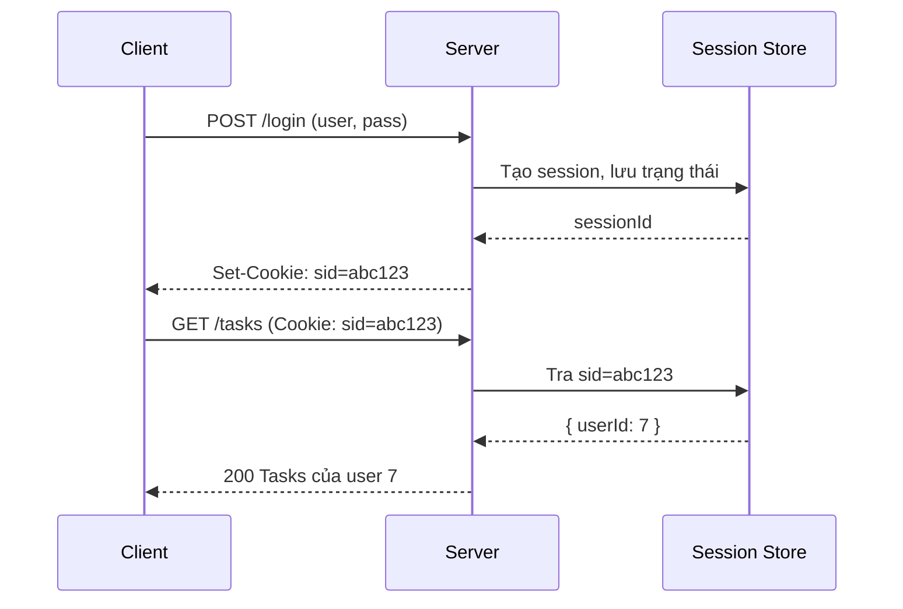
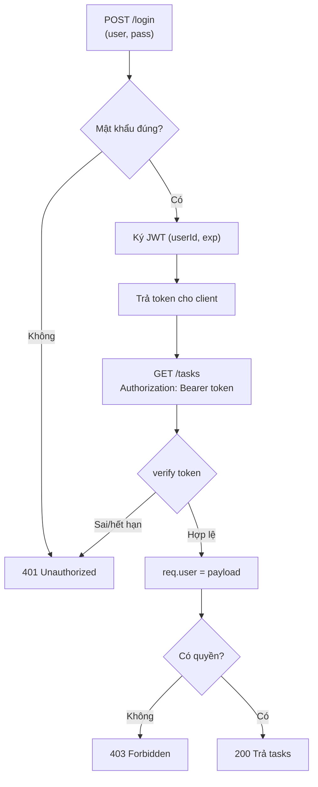

# Ngày 11 — Authentication & Security

## 🎯 Mục tiêu ngày

- Phân biệt **Authentication** (bạn là ai) vs **Authorization** (bạn được làm gì).
- Hiểu hai mô hình giữ phiên đăng nhập: **session + cookie** (stateful) vs **JWT** (stateless) — ưu/nhược và khi nào dùng cái nào.
- Nắm khái niệm **OAuth 2.0** (uỷ quyền bên thứ ba) và vai trò **SSL/TLS**.
- Áp dụng **rate limiting** để chống lạm dụng API.
- **Project Tasks API**: thêm đăng nhập bằng JWT, middleware bảo vệ route, và rate limiter.

> Đây là ngày nặng nhất tuần 2: 5 chủ đề lớn. OAuth 2.0 và TLS chỉ học ở mức **khái niệm** — đủ để trả lời phỏng vấn và biết khi nào cần, không đi sâu cài đặt provider.

---

## ❓ Câu hỏi cần trả lời được

1. Authentication và Authorization khác nhau thế nào?
2. Session-based và token-based (JWT) auth khác nhau ở đâu? Stateful vs stateless nghĩa là gì trong ngữ cảnh này?
3. Một JWT gồm mấy phần? Phần signature dùng để làm gì? Có nên lưu dữ liệu nhạy cảm trong payload không?
4. OAuth 2.0 giải quyết bài toán gì? Kể vai trò của Resource Owner, Client, Authorization Server.
5. SSL/TLS bảo vệ điều gì? Vì sao nó là điều kiện tiên quyết cho auth?
6. Rate limiting chống lại loại tấn công nào? Khác gì với throttling?

---

## 📚 Lý thuyết cốt lõi

### 1. Authentication vs Authorization

- **Authentication (AuthN)** — xác minh *danh tính*: "Bạn là ai?" (đăng nhập bằng mật khẩu, token…).
- **Authorization (AuthZ)** — xác minh *quyền*: "Bạn được phép làm gì?" (user thường vs admin).

AuthN luôn diễn ra trước AuthZ. Một request đã xác thực vẫn có thể bị từ chối nếu thiếu quyền (HTTP `403 Forbidden`), khác với chưa xác thực (`401 Unauthorized`).

### 2. Session + Cookie (stateful)

Server tạo một **session** lưu trên server (bộ nhớ/Redis/DB), gửi về client một **cookie** chứa session ID. Mỗi request sau, trình duyệt tự đính kèm cookie → server tra session ID để biết user.



- ✅ Thu hồi dễ (xoá session ở server). Cookie có thể `HttpOnly`, `Secure`, `SameSite`.
- ❌ **Stateful** — server phải lưu trạng thái → khó scale ngang (cần shared store như Redis).

### 3. JWT — JSON Web Token (stateless)

Server ký một token chứa thông tin user và gửi cho client. Client gửi lại token ở header `Authorization: Bearer <token>`. Server **chỉ cần verify chữ ký**, không cần tra DB → **stateless**.

Một JWT gồm **3 phần** ngăn bởi dấu chấm: `header.payload.signature`

```
eyJhbGciOiJIUzI1NiJ9 . eyJ1c2VySWQiOjcsImV4cCI6...} . SflKxwRJSMeKKF2QT4...
   └── Header (alg)        └── Payload (claims)         └── Signature
```

- **Header**: thuật toán ký (vd `HS256`).
- **Payload**: các *claim* (vd `userId`, `exp` hạn dùng). **Chỉ base64, KHÔNG mã hoá** → ai cũng đọc được. **Không bao giờ để mật khẩu/bí mật ở đây.**
- **Signature**: ký bằng secret của server → đảm bảo token không bị sửa.

```js
// Ký & verify JWT (ví dụ với jsonwebtoken)
import jwt from "jsonwebtoken";

const token = jwt.sign({ userId: 7 }, process.env.JWT_SECRET, {
  expiresIn: "1h",
});

// Verify — ném lỗi nếu chữ ký sai hoặc hết hạn
const payload = jwt.verify(token, process.env.JWT_SECRET); // { userId: 7, iat, exp }
```

| | Session + Cookie | JWT |
|---|---|---|
| Trạng thái | Stateful (lưu ở server) | Stateless (server không lưu) |
| Scale ngang | Cần shared store | Dễ (chỉ cần chung secret) |
| Thu hồi token | Dễ (xoá session) | Khó (phải chờ hết hạn / blacklist) |
| Kích thước gửi đi | Nhỏ (chỉ id) | Lớn hơn (cả payload mỗi request) |

### 4. OAuth 2.0 (khái niệm)

OAuth 2.0 là chuẩn **uỷ quyền**: cho phép một app truy cập tài nguyên của user ở một dịch vụ khác **mà không cần biết mật khẩu** (vd "Đăng nhập bằng Google").

Bốn vai trò:
- **Resource Owner** — người dùng sở hữu dữ liệu.
- **Client** — app muốn truy cập (vd app của bạn).
- **Authorization Server** — cấp token (vd Google).
- **Resource Server** — nơi giữ dữ liệu (vd Google API).

Luồng phổ biến (*Authorization Code*): user đồng ý → Authorization Server trả về một `code` → Client đổi `code` lấy `access_token` → dùng token gọi Resource Server.

> Phỏng vấn thường hỏi: "OAuth khác JWT thế nào?" → OAuth là **framework uỷ quyền** (luồng/giao thức); JWT là **định dạng token** có thể *được dùng bên trong* OAuth. Chúng không loại trừ nhau.

### 5. SSL/TLS

**TLS** (kế thừa SSL) mã hoá dữ liệu trên đường truyền (HTTPS). Nó đảm bảo:
- **Confidentiality** — kẻ nghe lén không đọc được.
- **Integrity** — dữ liệu không bị sửa giữa đường.
- **Authentication** — client xác minh đúng server (qua certificate).

Mọi cơ chế auth ở trên **đều vô nghĩa nếu không có TLS** — gửi token/cookie qua HTTP thường thì bị bắt gói là lộ ngay. Trong production, Node thường đứng sau reverse proxy (Nginx) hoặc nền tảng (Vercel) lo phần TLS.

### 6. Rate Limiting

Giới hạn số request mỗi client trong một khoảng thời gian → chống **brute-force** (dò mật khẩu), **DoS**, và lạm dụng API. Vượt giới hạn trả `429 Too Many Requests`.

- **Rate limiting**: chặn cứng khi vượt ngưỡng (vd 100 req/15 phút).
- **Throttling**: làm chậm lại thay vì chặn hẳn.

---

## 🗺️ Sơ đồ: Luồng xác thực JWT trên Tasks API



---

## 🛠️ Project Tasks API — Hôm nay làm gì

Thêm đăng nhập JWT + middleware bảo vệ + rate limiter cho Express app (từ Ngày 9).

```bash
npm install jsonwebtoken express-rate-limit
```

Đặt secret trong `.env` (xem Ngày 10) — **không hardcode**:

```bash
# .env
JWT_SECRET=doi-thanh-chuoi-ngau-nhien-dai
```

```js
// src/auth.js
import jwt from "jsonwebtoken";

const SECRET = process.env.JWT_SECRET;

// Giả lập 1 user (thực tế tra DB + so hash mật khẩu bằng bcrypt)
const USER = { id: 7, username: "intern", password: "node14" };

export function login(req, res) {
  const { username, password } = req.body;
  if (username !== USER.username || password !== USER.password) {
    return res.status(401).json({ error: "Sai thông tin đăng nhập" });
  }
  const token = jwt.sign({ userId: USER.id }, SECRET, { expiresIn: "1h" });
  res.json({ token });
}

// Middleware bảo vệ route
export function requireAuth(req, res, next) {
  const header = req.headers.authorization || "";
  const token = header.startsWith("Bearer ") ? header.slice(7) : null;
  if (!token) return res.status(401).json({ error: "Thiếu token" });
  try {
    req.user = jwt.verify(token, SECRET); // { userId, iat, exp }
    next();
  } catch {
    return res.status(401).json({ error: "Token không hợp lệ hoặc hết hạn" });
  }
}
```

```js
// src/app.js (trích)
import express from "express";
import rateLimit from "express-rate-limit";
import { login, requireAuth } from "./auth.js";

const app = express();
app.use(express.json());

// Rate limit cho route đăng nhập: 5 lần / 15 phút
const loginLimiter = rateLimit({ windowMs: 15 * 60 * 1000, max: 5 });

app.post("/login", loginLimiter, login);

// Mọi route /tasks yêu cầu đăng nhập
app.get("/tasks", requireAuth, (req, res) => {
  res.json({ userId: req.user.userId, tasks: [] });
});

export default app;
```

Thử nhanh:

```bash
# Lấy token
curl -s -X POST localhost:3000/login -H 'Content-Type: application/json' \
  -d '{"username":"intern","password":"node14"}'

# Gọi route bảo vệ
curl localhost:3000/tasks -H "Authorization: Bearer <token-vừa-lấy>"
```

---

## ✏️ Bài tập

1. Thêm middleware `requireRole("admin")` minh hoạ **Authorization**: chỉ user có `role === "admin"` (đọc từ payload JWT) mới được `DELETE /tasks/:id`, ngược lại trả `403`.
2. Hiện đang so sánh mật khẩu plaintext — sai lầm bảo mật. Đổi sang **hash** bằng `bcrypt`: lưu hash, khi login dùng `bcrypt.compare`.
3. Thêm rate limiter toàn cục (vd 100 req/15 phút) cho mọi route, và một limiter chặt hơn riêng cho `/login`. Quan sát status `429` khi vượt.
4. Giải thích bằng lời: vì sao **không** nên lưu JWT trong `localStorage` mà nên dùng cookie `HttpOnly`? (gợi ý: XSS).

---

## ✅ Self-check (đáp án ngắn)

1. **AuthN** xác minh *bạn là ai*; **AuthZ** xác minh *bạn được làm gì*. Chưa xác thực → `401`, thiếu quyền → `403`.
2. Session lưu trạng thái ở server (stateful, dễ thu hồi, khó scale); JWT không lưu ở server (stateless, dễ scale, khó thu hồi trước hạn).
3. JWT có 3 phần: header, payload, signature. Signature đảm bảo token không bị sửa. **Không** để dữ liệu nhạy cảm trong payload vì nó chỉ base64, ai cũng đọc được.
4. OAuth 2.0 cho phép app truy cập dữ liệu user ở dịch vụ khác mà không cần mật khẩu. Vai trò: Resource Owner (user), Client (app), Authorization Server (cấp token), Resource Server (giữ dữ liệu).
5. TLS đảm bảo bí mật + toàn vẹn + xác thực server trên đường truyền. Không có TLS thì token/cookie bị bắt gói là lộ → auth vô nghĩa.
6. Rate limiting chống brute-force và DoS bằng cách chặn khi vượt ngưỡng (trả `429`); throttling thì làm chậm thay vì chặn hẳn.
