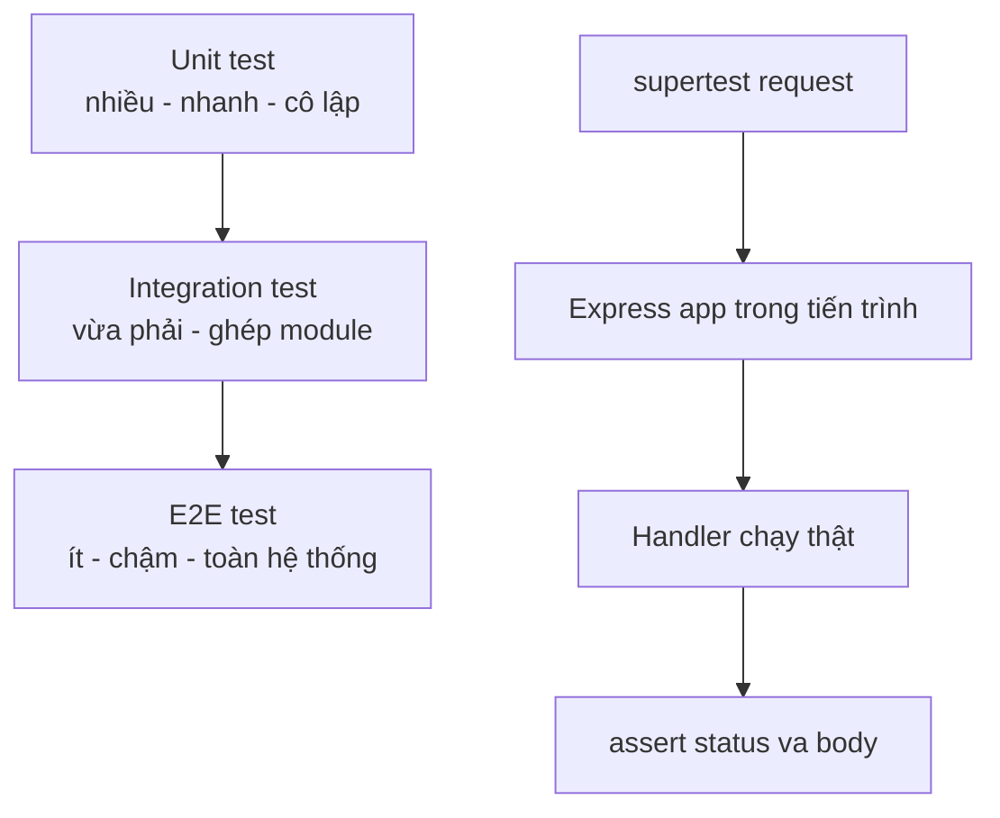

# Ngày 12 — Testing với node:test & supertest

## 🎯 Mục tiêu ngày

- Hiểu vì sao Node 18+ có **test runner built-in** (`node:test`) — viết test mà **không cần cài Jest**.
- Phân biệt **unit test** (kiểm tra hàm thuần, cô lập) vs **integration test** (kiểm tra nhiều phần ghép lại, vd HTTP endpoint).
- Dùng **supertest** để test HTTP endpoint bằng cách bắn request thẳng vào Express app — không cần `listen` cổng thật.
- Nắm khái niệm **stub/mock** để cô lập đơn vị cần test (vd giả lập `taskRepo`).
- **Project Tasks API**: viết unit test cho hàm thuần và integration test cho `GET`/`POST /tasks`.

> Test là kỹ năng tách biệt giữa "code chạy được" và "code đáng tin cậy". Hôm nay học runtime built-in trước, vì nó là chuẩn hiện đại và phỏng vấn ngày càng hỏi. Khái niệm mock chỉ cần hiểu ý tưởng, không cần thuộc API thư viện.

---

## ❓ Câu hỏi cần trả lời được

1. `node:test` là gì? Vì sao có thể test mà không cần thêm thư viện như Jest?
2. Unit test và integration test khác nhau ở đâu? Khi nào dùng cái nào?
3. Cấu trúc **arrange-act-assert** là gì? Vì sao nó giúp test dễ đọc?
4. `supertest` giúp test endpoint thế nào mà không cần mở cổng thật?
5. Stub/mock dùng để làm gì? Vì sao cần cô lập đơn vị khi test?
6. Lệnh nào chạy toàn bộ test trong project?

---

## 📚 Lý thuyết cốt lõi

### 1. node:test — test runner built-in

Từ Node 18+, Node có sẵn module `node:test` và `node:assert`. Không cần cài Jest/Mocha cho các nhu cầu cơ bản.

```js
// math.test.js
import { test, describe } from "node:test";
import assert from "node:assert/strict";

function add(a, b) {
  return a + b;
}

describe("add()", () => {
  test("cộng hai số dương", () => {
    assert.equal(add(2, 3), 5);
  });

  test("cộng với số âm", () => {
    assert.equal(add(5, -2), 3);
  });
});
```

Chạy:

```bash
node --test
```

Node tự tìm file khớp mẫu (`*.test.js`, file trong thư mục `test/`...) và chạy chúng.

### 2. Unit test vs Integration test

- **Unit test** — kiểm tra **một đơn vị nhỏ** (thường là một hàm thuần) tách biệt khỏi phần khác. Nhanh, dễ chỉ ra lỗi nằm đâu.
- **Integration test** — kiểm tra **nhiều phần ghép lại** hoạt động đúng cùng nhau (vd route → service → DB). Chậm hơn nhưng bắt được lỗi ở ranh giới các module.

| Tiêu chí | Unit test | Integration test |
|---|---|---|
| Phạm vi | Một hàm/đơn vị | Nhiều phần ghép lại |
| Tốc độ | Rất nhanh | Chậm hơn |
| Phụ thuộc ngoài | Mock/stub hết | Có thể dùng DB test thật |
| Khi lỗi | Biết ngay chỗ sai | Phải truy ngược |
| Số lượng nên có | Nhiều | Ít hơn |

### 3. Arrange — Act — Assert

Một test dễ đọc thường chia 3 bước rõ ràng:

```js
test("add() tạo task mới", () => {
  // Arrange — chuẩn bị dữ liệu/đối tượng
  const store = [];

  // Act — thực thi hành vi cần kiểm tra
  store.push({ id: 1, title: "Học test", done: false });

  // Assert — khẳng định kết quả mong đợi
  assert.equal(store.length, 1);
  assert.equal(store[0].title, "Học test");
});
```

### 4. supertest — test HTTP endpoint

`supertest` bọc Express app và gửi request **trong tiến trình**, không cần `app.listen()` mở cổng thật. Nhờ vậy test nhanh và không đụng cổng đang bận.

```js
import request from "supertest";
import app from "../src/app.js";

const res = await request(app).get("/tasks");
// res.status, res.body sẵn sàng để assert
```

Chính vì vậy ở Ngày 9 ta tách `app.js` (export `app`) khỏi `server.js` (gọi `listen`) — để test import được `app` mà không khởi động server.

### 5. Stub & Mock — cô lập đơn vị

Khi test một hàm phụ thuộc vào DB hay API ngoài, ta thay phần phụ thuộc đó bằng **bản giả** trả về giá trị định sẵn:

- **Stub** — bản giả trả về giá trị cố định (vd `taskRepo.getAll()` luôn trả mảng rỗng).
- **Mock** — như stub nhưng còn ghi lại nó được gọi bao nhiêu lần, với tham số gì → để assert tương tác.

`node:test` có sẵn API mock cơ bản:

```js
import { test, mock } from "node:test";
import assert from "node:assert/strict";

test("gọi đúng repo", () => {
  const repo = { save: mock.fn(() => ({ id: 1 })) };
  repo.save({ title: "x" });
  assert.equal(repo.save.mock.calls.length, 1);
});
```

Ngoài ra hệ sinh thái còn có thư viện kiểu **Sinon** cho stub/spy/mock phong phú hơn, nhưng ý tưởng cốt lõi vẫn là: **giả lập phụ thuộc để test cô lập**.

---

## 🗺️ Sơ đồ: Kim tự tháp test & luồng integration



---

## 🛠️ Project Tasks API — Hôm nay làm gì

Viết test cho Tasks API: unit test cho hàm thuần và integration test cho endpoint.

```bash
npm install --save-dev supertest
```

Đảm bảo có script test trong `package.json`:

```jsonc
{
  "scripts": {
    "test": "node --test"
  }
}
```

Unit test cho hàm thuần trong `src/tasks.js` (từ Ngày 1):

```js
// test/tasks.unit.test.js
import { test, describe } from "node:test";
import assert from "node:assert/strict";
import { add, getAll } from "../src/tasks.js";

describe("tasks store", () => {
  test("add() trả về task có id và done=false", () => {
    // Arrange + Act
    const task = add("Viết test");
    // Assert
    assert.ok(task.id > 0);
    assert.equal(task.title, "Viết test");
    assert.equal(task.done, false);
  });

  test("getAll() chứa task vừa thêm", () => {
    add("Task kiểm tra");
    const all = getAll();
    assert.ok(all.some((t) => t.title === "Task kiểm tra"));
  });
});
```

Integration test cho endpoint bằng supertest:

```js
// test/tasks.api.test.js
import { test, describe } from "node:test";
import assert from "node:assert/strict";
import request from "supertest";
import app from "../src/app.js";

describe("Tasks API", () => {
  test("GET /tasks trả 200 và mảng", async () => {
    const res = await request(app).get("/tasks");
    assert.equal(res.status, 200);
    assert.ok(Array.isArray(res.body.tasks));
  });

  test("POST /tasks tạo task mới trả 201", async () => {
    const res = await request(app)
      .post("/tasks")
      .send({ title: "Task từ test" })
      .set("Content-Type", "application/json");

    assert.equal(res.status, 201);
    assert.equal(res.body.title, "Task từ test");
  });

  test("POST /tasks thiếu title trả 400", async () => {
    const res = await request(app).post("/tasks").send({});
    assert.equal(res.status, 400);
  });
});
```

Chạy toàn bộ test:

```bash
npm test
```

> Lưu ý: nếu endpoint có auth (Ngày 11), test cần gắn token vào header `Authorization`. Với DB (SQLite), nên dùng **DB test riêng** (vd file tạm hoặc `:memory:`) để test không đụng dữ liệu thật.

---

## ✏️ Bài tập

1. Viết unit test cho hàm `remove(id)` (Ngày 1): kiểm tra cả trường hợp xoá thành công và trường hợp `id` không tồn tại trả về `null`.
2. Viết integration test cho `GET /tasks/:id`: một test cho id tồn tại (200), một test cho id không tồn tại (404).
3. Dùng `mock.fn()` của `node:test` để giả lập một `taskRepo.save` và assert nó được gọi đúng 1 lần khi `POST /tasks`.
4. Cấu hình DB test riêng dùng SQLite `:memory:` cho integration test, đảm bảo mỗi lần chạy test bắt đầu với dữ liệu sạch.

---

## ✅ Self-check (đáp án ngắn)

1. `node:test` là test runner built-in từ Node 18+; cùng `node:assert` cho phép viết và chạy test mà không cần cài Jest/Mocha.
2. Unit test kiểm tra một hàm cô lập (nhanh, chỉ rõ lỗi); integration test kiểm tra nhiều phần ghép lại như route + service + DB (chậm hơn, bắt lỗi ở ranh giới).
3. Arrange-act-assert: chuẩn bị dữ liệu → thực thi hành vi → khẳng định kết quả; tách 3 bước giúp test rõ ràng, dễ đọc.
4. `supertest` gửi request thẳng vào Express app trong tiến trình, không cần `app.listen()` mở cổng thật.
5. Stub/mock thay phụ thuộc ngoài (DB, API) bằng bản giả trả giá trị định sẵn để test đơn vị cô lập, không bị ảnh hưởng bởi yếu tố bên ngoài.
6. `node --test` (hoặc `npm test` nếu đã đặt script) chạy toàn bộ test trong project.
