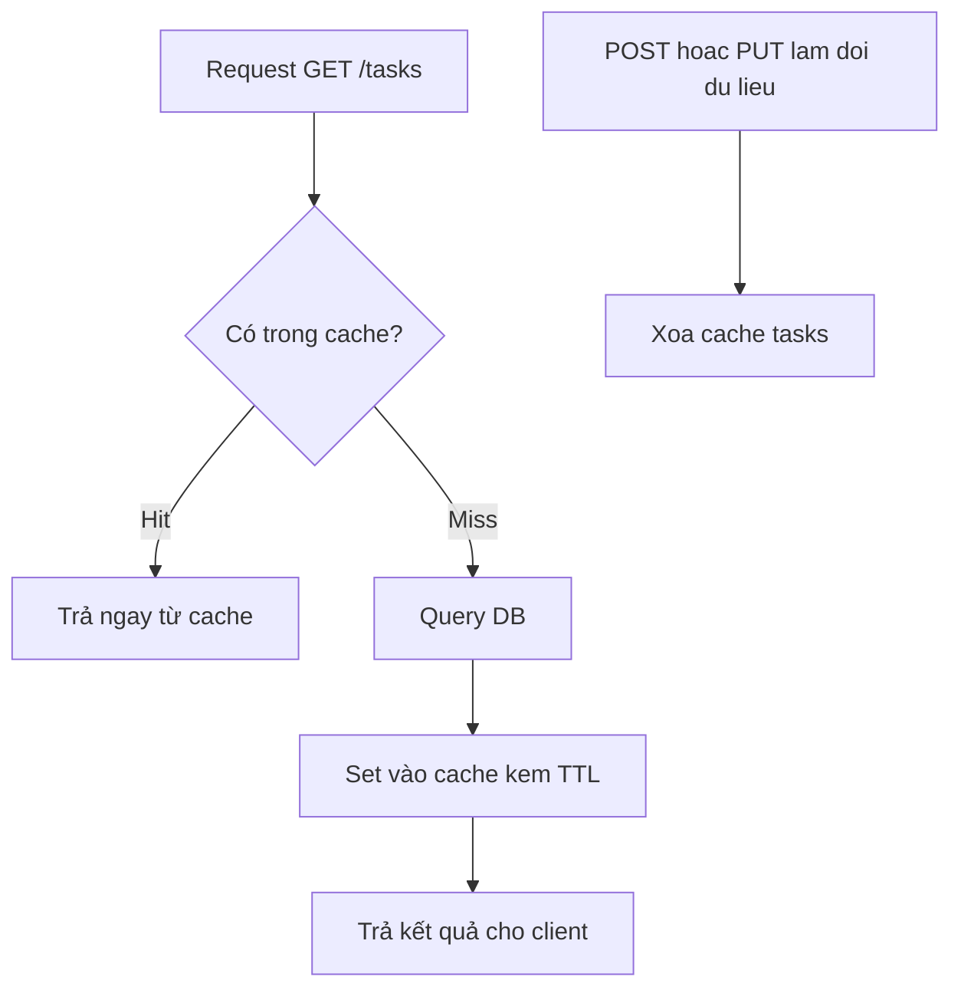

# Ngày 13 — Caching & Performance

## 🎯 Mục tiêu ngày

- Hiểu **HTTP caching**: header `Cache-Control`, `ETag`, và phản hồi `304 Not Modified`.
- Nắm khái niệm **Redis** và mẫu **cache-aside** (đọc cache trước, miss thì query DB rồi set cache).
- Đo hiệu năng bằng **perf_hooks** (`performance.mark`/`measure` + `PerformanceObserver`); biết `async_hooks` ở mức khái niệm.
- Hiểu vì sao **cache invalidation** là một trong những vấn đề khó nhất.
- **Project Tasks API**: thêm `ETag` cho `GET /tasks`, minh hoạ cache-aside in-memory, và đo thời gian một handler.

> Cache làm hệ thống nhanh hơn bằng cách tránh lặp lại việc tốn kém. Nhưng "có 2 vấn đề khó trong khoa học máy tính: đặt tên và cache invalidation". Hôm nay học cách thêm cache đúng chỗ và cách *đo* để biết nó có thật sự nhanh hơn không.

---

## ❓ Câu hỏi cần trả lời được

1. `Cache-Control` và `ETag` khác nhau vai trò thế nào? Khi nào server trả `304`?
2. Mẫu **cache-aside** hoạt động ra sao? Điều gì xảy ra khi cache hit và khi cache miss?
3. Redis là gì? Vì sao nó hợp làm cache layer?
4. `perf_hooks` dùng để làm gì? `performance.mark` và `performance.measure` khác nhau ra sao?
5. Vì sao cache invalidation lại khó?
6. `async_hooks` theo dõi cái gì?

---

## 📚 Lý thuyết cốt lõi

### 1. HTTP caching: Cache-Control & ETag

Trình duyệt và proxy có thể lưu lại phản hồi để khỏi tải lại. Hai cơ chế chính:

- **`Cache-Control`** — server nói client được cache bao lâu (vd `max-age=60` là 60 giây).
- **`ETag`** — một "vân tay" (hash) của nội dung. Client gửi lại ETag cũ qua header `If-None-Match`; nếu nội dung không đổi, server trả **`304 Not Modified`** với body rỗng → tiết kiệm băng thông.

```
# Lần đầu
GET /tasks            -> 200, ETag: "abc123"

# Lần sau client gửi kèm ETag
GET /tasks
If-None-Match: "abc123"
-> 304 Not Modified   (body rỗng, client dùng bản đã cache)
```

### 2. Cache-aside pattern

Mẫu cache phổ biến nhất cho dữ liệu đọc nhiều: **app quản lý cache, không phải DB**.

1. Đọc cache trước.
2. **Hit** → trả luôn.
3. **Miss** → query DB → set vào cache → trả kết quả.

```js
async function getTasks(cache, db) {
  const cached = cache.get("tasks");
  if (cached) return cached; // hit

  const tasks = await db.queryAll("tasks"); // miss -> query DB
  cache.set("tasks", tasks); // set cache cho lần sau
  return tasks;
}
```

### 3. Redis (khái niệm)

**Redis** là một in-memory data store (lưu dữ liệu trong RAM) cực nhanh, thường dùng làm **cache layer** chung cho nhiều instance Node. Vì nằm ngoài tiến trình Node, nhiều server có thể chia sẻ cùng một cache — giải bài toán cache cục bộ không đồng nhất khi scale ngang.

- ✅ Rất nhanh (RAM), hỗ trợ TTL (tự hết hạn key), nhiều kiểu dữ liệu.
- ✅ Chia sẻ giữa nhiều instance → hợp với hệ thống scale ngang.
- ❌ Thêm một thành phần hạ tầng phải vận hành; dữ liệu RAM dễ mất nếu không cấu hình bền vững.

### 4. Đo hiệu năng với perf_hooks

Đừng đoán — hãy **đo**. Module `perf_hooks` cho phép đánh dấu mốc thời gian chính xác:

```js
import { performance, PerformanceObserver } from "node:perf_hooks";

// Lắng nghe các measure
const obs = new PerformanceObserver((list) => {
  for (const entry of list.getEntries()) {
    console.log(`${entry.name}: ${entry.duration.toFixed(2)}ms`);
  }
});
obs.observe({ entryTypes: ["measure"] });

performance.mark("start");
// ... việc cần đo ...
performance.mark("end");
performance.measure("xử lý tasks", "start", "end");
```

- `performance.mark(name)` — đánh một **mốc** thời gian.
- `performance.measure(name, start, end)` — tính **khoảng cách** giữa hai mốc.
- `PerformanceObserver` — nhận kết quả đo bất đồng bộ.

### 5. async_hooks (khái niệm)

`async_hooks` cho phép **theo dõi vòng đời của async resource** (mỗi Promise, timer, request... được Node gán một `asyncId`). Nó là nền tảng cho các công cụ tracing/APM và `AsyncLocalStorage` (lưu context xuyên suốt một chuỗi async, vd request ID cho logging). Ở mức intern chỉ cần biết: **nó dùng để quan sát async, không phải để viết logic thường ngày**.

### 6. Cache invalidation là khó

Cache giúp nhanh, nhưng khi dữ liệu gốc đổi mà cache chưa cập nhật → trả **dữ liệu cũ (stale)**. Quyết định *khi nào* xoá/làm mới cache rất khó cân bằng:

- Hết hạn quá nhanh → cache ít tác dụng, vẫn query DB nhiều.
- Hết hạn quá chậm → user thấy dữ liệu lỗi thời.
- Khi `POST`/`PUT`/`DELETE` đổi dữ liệu, phải nhớ **xoá cache liên quan** — dễ sót.

---

## 🗺️ Sơ đồ: Luồng cache-aside



---

## 🛠️ Project Tasks API — Hôm nay làm gì

Thêm `ETag` cho `GET /tasks`, cache-aside in-memory, và đo thời gian handler.

```js
// src/cache.js — cache-aside in-memory đơn giản bằng Map
const store = new Map();

export function get(key) {
  const entry = store.get(key);
  if (!entry) return null;
  if (Date.now() > entry.expireAt) {
    store.delete(key); // hết hạn
    return null;
  }
  return entry.value;
}

export function set(key, value, ttlMs = 30_000) {
  store.set(key, { value, expireAt: Date.now() + ttlMs });
}

export function invalidate(key) {
  store.delete(key);
}
```

ETag + cache-aside cho route `GET /tasks`:

```js
// src/app.js (trích)
import crypto from "node:crypto";
import { performance } from "node:perf_hooks";
import * as cache from "./cache.js";
import { getAll } from "./tasks.js";

function etagOf(data) {
  return crypto.createHash("sha1").update(JSON.stringify(data)).digest("hex");
}

app.get("/tasks", (req, res) => {
  const start = performance.now();

  // Cache-aside
  let tasks = cache.get("tasks");
  if (!tasks) {
    tasks = getAll(); // miss -> "query" rồi set
    cache.set("tasks", tasks);
  }

  // ETag: nếu khớp If-None-Match -> 304
  const etag = etagOf(tasks);
  res.set("ETag", etag);
  if (req.headers["if-none-match"] === etag) {
    return res.status(304).end();
  }

  res.json({ tasks });
  console.log(`GET /tasks mất ${(performance.now() - start).toFixed(2)}ms`);
});
```

Đừng quên xoá cache khi dữ liệu đổi:

```js
// Sau khi POST/PUT/DELETE thành công
import * as cache from "./cache.js";
cache.invalidate("tasks");
```

Thử ETag:

```bash
# Lần đầu — lấy ETag từ header
curl -i localhost:3000/tasks

# Gửi lại ETag — sẽ nhận 304
curl -i localhost:3000/tasks -H 'If-None-Match: "<etag-vừa-lấy>"'
```

---

## ✏️ Bài tập

1. Thêm TTL khác nhau cho cache: thử `5_000ms` rồi quan sát sau 5 giây request lại sẽ "miss" và query lại.
2. Dùng `PerformanceObserver` + `performance.mark`/`measure` để đo riêng phần "query" và phần "serialize JSON" trong handler, in ra hai con số.
3. Khi `POST /tasks` tạo task mới, đảm bảo gọi `cache.invalidate("tasks")` và viết test kiểm tra `GET /tasks` ngay sau đó trả dữ liệu mới (không stale).
4. Giải thích bằng lời: vì sao cache in-memory bằng `Map` **không** đủ khi app chạy nhiều instance? Redis giải quyết điều này thế nào?

---

## ✅ Self-check (đáp án ngắn)

1. `Cache-Control` nói client được cache bao lâu; `ETag` là vân tay nội dung — khi client gửi lại qua `If-None-Match` mà nội dung không đổi, server trả `304` với body rỗng.
2. Cache-aside: đọc cache trước; hit thì trả luôn; miss thì query DB, set cache, rồi trả kết quả.
3. Redis là in-memory store rất nhanh, nằm ngoài tiến trình Node nên nhiều instance chia sẻ chung cache được → hợp làm cache layer khi scale ngang.
4. `perf_hooks` đo thời gian chính xác: `performance.mark` đánh một mốc, `performance.measure` tính khoảng cách giữa hai mốc; `PerformanceObserver` nhận kết quả.
5. Cache invalidation khó vì phải cân bằng giữa dữ liệu mới và hiệu quả cache: hết hạn quá nhanh thì ít tác dụng, quá chậm thì trả dữ liệu stale, và dễ quên xoá cache khi dữ liệu đổi.
6. `async_hooks` theo dõi vòng đời của các async resource (Promise, timer, request...) — nền tảng cho tracing/APM và `AsyncLocalStorage`.
