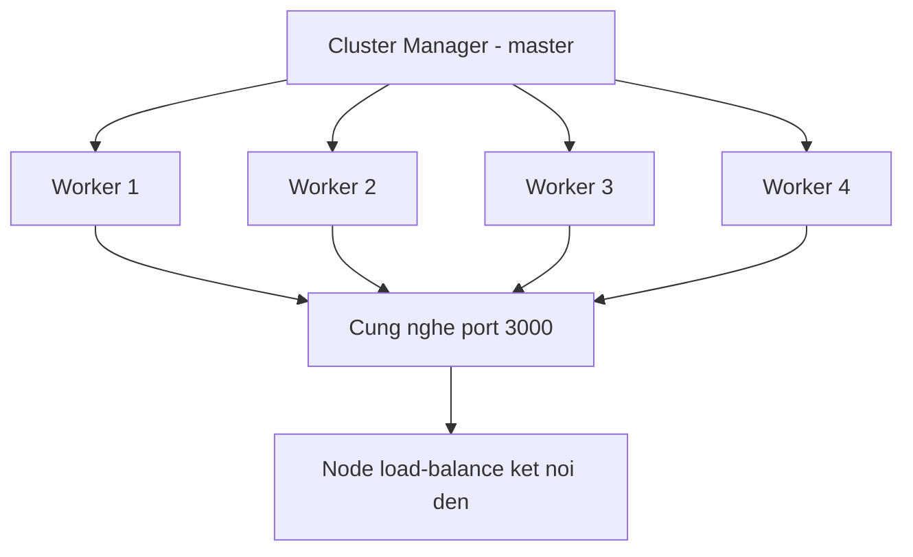

# Ngày 14 — Concurrency, Real-time, Microservices & Tổng kết

## 🎯 Mục tiêu ngày

- Hiểu **clustering**: Node mặc định chạy 1 core; cluster mode chạy nhiều process để tận dụng đa nhân.
- Phân biệt **Cluster** (nhiều process) vs **Worker Threads** (nhiều thread trong 1 process) và khi nào dùng cái nào.
- Nắm khái niệm **load balancing**, **WebSocket** (real-time 2 chiều), **microservices**, và **message queue**.
- **Project Tasks API**: chạy app với `cluster` theo số CPU; phác hoạ endpoint WebSocket thông báo task mới.
- **Tổng kết 14 ngày** + checklist phỏng vấn.

> Ngày cuối nhìn lên tầm hệ thống: từ một process đơn lẻ đến hệ thống nhiều process, real-time, và nhiều service. Các chủ đề này học ở mức **khái niệm** để trả lời phỏng vấn và biết hướng đi tiếp theo, không cần triển khai production.

---

## ❓ Câu hỏi cần trả lời được

1. Vì sao Node mặc định chỉ dùng 1 core? Cluster mode giải quyết điều này thế nào?
2. Cluster và Worker Threads khác nhau ở đâu? Mỗi cái hợp với loại tác vụ nào?
3. Load balancing là gì? Round-robin nghĩa là gì?
4. WebSocket khác HTTP request/response thế nào? Khi nào cần dùng?
5. Microservices là gì? Ưu/nhược so với monolith?
6. Message queue giải quyết bài toán gì trong giao tiếp giữa các service?

---

## 📚 Lý thuyết cốt lõi

### 1. Clustering

Một tiến trình Node chạy trên **một event loop**, dùng **một CPU core**. Máy chủ thường có nhiều core → để tận dụng, ta chạy **nhiều process Node** bằng module `cluster`.

- Một **cluster manager** (master) fork ra nhiều **worker process**.
- Các worker **cùng nghe chung một port** — Node phân phối kết nối đến cho chúng.
- Mỗi worker có event loop riêng → xử lý song song trên nhiều core.

```js
import cluster from "node:cluster";
import os from "node:os";

if (cluster.isPrimary) {
  const cpus = os.availableParallelism();
  for (let i = 0; i < cpus; i++) cluster.fork(); // tạo worker theo số CPU
  cluster.on("exit", (worker) => {
    console.log(`Worker ${worker.process.pid} chết, fork lại`);
    cluster.fork(); // tự phục hồi
  });
} else {
  // Mỗi worker chạy server riêng, cùng nghe port 3000
  startServer();
}
```

### 2. Cluster vs Worker Threads

Cả hai cho phép chạy song song, nhưng khác bản chất:

| Tiêu chí | Cluster | Worker Threads |
|---|---|---|
| Đơn vị | Nhiều process | Nhiều thread trong 1 process |
| Bộ nhớ | Tách biệt, không chia sẻ | Chia sẻ qua SharedArrayBuffer |
| Giao tiếp | IPC giữa process | message passing trong process |
| Hợp với | Mở rộng nhiều server HTTP | Tác vụ CPU-intensive (tính toán nặng) |
| Chi phí khởi tạo | Nặng hơn (cả process) | Nhẹ hơn (thread) |

Tóm gọn: **Cluster** để phục vụ nhiều request HTTP hơn; **Worker Threads** để giải toán nặng (xử lý ảnh, nén, mã hoá) mà không chặn event loop chính.

### 3. Load balancing

Khi có nhiều instance (nhiều process hoặc nhiều máy), cần **phân phối request** đều cho chúng — đó là **load balancing**. Chiến lược phổ biến nhất là **round-robin**: lần lượt gửi request cho từng instance theo vòng tròn. Trong cluster mode, Node tự load-balance kết nối giữa các worker; ở quy mô lớn hơn, một reverse proxy (Nginx) hoặc cloud load balancer lo việc này giữa nhiều máy.

### 4. WebSocket — real-time 2 chiều

HTTP là **request/response**: client hỏi, server trả, rồi đóng. Không hợp cho thứ cần **server chủ động đẩy** dữ liệu (chat, notification, dashboard live).

**WebSocket** mở **một kết nối full-duplex bền vững**: sau cái bắt tay ban đầu (nâng cấp từ HTTP), cả hai phía gửi dữ liệu cho nhau bất cứ lúc nào trên cùng kết nối. Thư viện phổ biến trong Node là **ws**.

```js
import { WebSocketServer } from "ws";

const wss = new WebSocketServer({ port: 8080 });
wss.on("connection", (socket) => {
  socket.send("Chào, bạn đã kết nối real-time");
  socket.on("message", (msg) => console.log("Nhận:", msg.toString()));
});

// Broadcast tới mọi client đang kết nối
function broadcast(data) {
  for (const client of wss.clients) client.send(JSON.stringify(data));
}
```

### 5. Microservices

**Monolith** gom mọi chức năng trong một app duy nhất. Khi app lớn lên, kiến trúc **microservices** (tiến hoá từ SOA) tách app thành nhiều **service nhỏ độc lập**, mỗi service lo một miền nghiệp vụ và giao tiếp qua network (HTTP/gRPC/message queue).

- ✅ Mỗi service deploy/scale độc lập; team nhỏ làm chủ một service; lỗi cô lập tốt hơn.
- ❌ Phức tạp vận hành (network, observability, transaction phân tán); khó debug xuyên service.

> Phỏng vấn hay hỏi: "Khi nào nên dùng microservices?" → Thường nên **bắt đầu bằng monolith** rồi tách dần khi thật sự cần, vì microservices trả giá bằng độ phức tạp hạ tầng.

### 6. Message Queue

Giữa các service, gọi nhau trực tiếp (đồng bộ) khiến chúng phụ thuộc chặt và dễ sập dây chuyền. **Message queue** (vd RabbitMQ, Kafka) cho phép giao tiếp **bất đồng bộ**: service A đẩy message vào queue, service B xử lý khi rảnh.

- **Decoupling** — A không cần biết B, chỉ cần biết queue.
- **Buffer tải** — lúc cao điểm message xếp hàng chờ, B xử lý dần thay vì quá tải.
- **Độ bền** — message không mất nếu B tạm chết.

---

## 🗺️ Sơ đồ: Cluster mode trên Tasks API



---

## 🛠️ Project Tasks API — Hôm nay làm gì

Chạy Tasks API với `cluster` theo số CPU, và phác hoạ WebSocket thông báo task mới.

```js
// src/cluster.js — chạy app trên nhiều core
import cluster from "node:cluster";
import os from "node:os";
import app from "./app.js";

const PORT = process.env.PORT || 3000;

if (cluster.isPrimary) {
  const cpus = os.availableParallelism();
  console.log(`Master ${process.pid} fork ${cpus} worker`);
  for (let i = 0; i < cpus; i++) cluster.fork();

  cluster.on("exit", (worker) => {
    console.log(`Worker ${worker.process.pid} chết, fork lại`);
    cluster.fork();
  });
} else {
  app.listen(PORT, () => {
    console.log(`Worker ${process.pid} nghe port ${PORT}`);
  });
}
```

Chạy:

```bash
node src/cluster.js
```

Phác hoạ WebSocket thông báo task mới (mức demo/khái niệm):

```js
// src/realtime.js
import { WebSocketServer } from "ws";

let wss;

export function initRealtime(server) {
  wss = new WebSocketServer({ server }); // gắn cùng HTTP server
}

// Gọi khi có task mới được tạo
export function notifyNewTask(task) {
  if (!wss) return;
  const payload = JSON.stringify({ type: "task_created", task });
  for (const client of wss.clients) client.send(payload);
}
```

```js
// Trong handler POST /tasks, sau khi tạo task thành công:
import { notifyNewTask } from "./realtime.js";
notifyNewTask(newTask); // mọi client đang xem nhận thông báo ngay
```

> Lưu ý khi kết hợp cluster + WebSocket: mỗi worker giữ tập client riêng, nên broadcast giữa tất cả client cần một lớp pub/sub chung (vd Redis pub/sub). Ở mức học, chỉ cần hiểu vì sao cần nó.

---

## 🎓 Checklist phỏng vấn

Ôn tập trải đều 14 ngày — tự trả lời ngắn gọn từng câu:

1. **Day 1** — First-class function là gì? Phân biệt CommonJS và ESM. `^1.2.3` trong semver nghĩa là gì?
2. **Day 2/3** — Event loop hoạt động thế nào? Các pha chính? `process.nextTick` vs `setImmediate` khác nhau ra sao?
3. **Day 3** — Callback hell là gì? Promise và async/await giải quyết thế nào? `Promise.all` vs `Promise.race`?
4. **Day 4** — Vì sao Node "single-threaded nhưng non-blocking"? libuv và thread pool đóng vai trò gì?
5. **Day 5** — Stream là gì? Bốn loại stream? Backpressure nghĩa là gì?
6. **Day 6** — Buffer dùng để làm gì? `EventEmitter` hoạt động thế nào?
7. **Day 7** — Các module core hay dùng (`fs`, `path`, `http`, `crypto`)? Sync vs async API khác gì?
8. **Day 8** — REST API là gì? Các HTTP method và status code chính (200/201/400/401/403/404/500)?
9. **Day 9** — Middleware trong Express là gì? Thứ tự chạy ra sao? Error-handling middleware có gì đặc biệt?
10. **Day 10** — Vì sao không hardcode secret? `.env` và biến môi trường dùng thế nào? SQL injection phòng bằng gì?
11. **Day 11** — Authentication vs Authorization? Session vs JWT (stateful vs stateless)? Rate limiting chống tấn công gì?
12. **Day 12** — Unit test vs integration test? `node:test` là gì? supertest test endpoint thế nào? Stub/mock dùng làm gì?
13. **Day 13** — `ETag` và `304` hoạt động ra sao? Cache-aside pattern? Vì sao cache invalidation khó?
14. **Day 14** — Cluster vs Worker Threads? WebSocket khác HTTP thế nào? Microservices ưu/nhược gì? Message queue giải quyết bài toán gì?
15. **Tổng hợp** — Khi một endpoint chậm, bạn debug và tối ưu theo trình tự nào? (đo bằng `perf_hooks` → tìm nút thắt → cache/async/cluster tuỳ nguyên nhân).

---

## ✏️ Bài tập

1. Chạy `src/cluster.js`, gửi nhiều request đồng thời và quan sát log `process.pid` khác nhau để xác nhận request được phân cho nhiều worker.
2. Viết một tác vụ CPU-intensive (vd tính số nguyên tố lớn) và chuyển nó sang **Worker Threads** để không chặn event loop chính; so sánh với khi chạy trực tiếp trong handler.
3. Dựng một WebSocket server nhỏ bằng `ws`: client gửi message, server broadcast cho mọi client khác (mini chat). Tích hợp `notifyNewTask` vào `POST /tasks`.
4. Vẽ (bằng lời hoặc sơ đồ) kiến trúc tách Tasks API thành 2 service: `auth-service` và `tasks-service`, nêu chúng giao tiếp qua gì và đánh đổi gì so với monolith.

---

## ✅ Self-check (đáp án ngắn)

1. Một process Node dùng một event loop trên một core; cluster mode fork nhiều worker process cùng nghe chung port để tận dụng nhiều core.
2. Cluster = nhiều process bộ nhớ tách biệt, hợp mở rộng nhiều server HTTP; Worker Threads = nhiều thread trong một process chia sẻ memory, hợp tác vụ CPU-intensive.
3. Load balancing phân phối request cho nhiều instance; round-robin là gửi lần lượt cho từng instance theo vòng tròn.
4. HTTP là request/response rồi đóng; WebSocket mở kết nối full-duplex bền vững để server chủ động đẩy dữ liệu — hợp cho chat, notification, dashboard real-time.
5. Microservices tách app thành các service nhỏ độc lập giao tiếp qua network; ưu là deploy/scale độc lập và cô lập lỗi, nhược là phức tạp vận hành và khó debug xuyên service.
6. Message queue cho giao tiếp bất đồng bộ giữa service: decoupling, buffer tải lúc cao điểm, và giữ message bền khi bên xử lý tạm chết.
